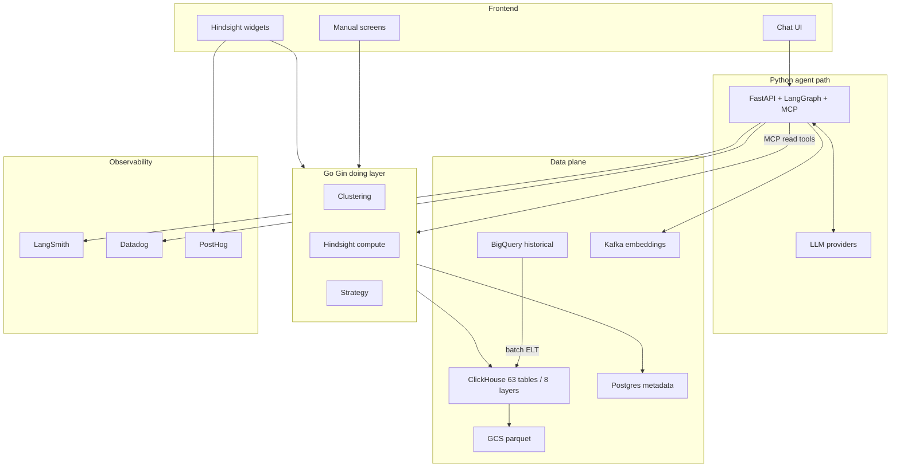

# Architecture — Impact Analytics AssortSmart + Hindsight

Defend every Tech line item: where used, why chosen, DB shape, end-to-end flow.

## 1. Where each tech is used (and why)

| Tech | Where in the system | Why this tech |
|---|---|---|
| **Python / FastAPI** | Agent service: chat HTTP API, auth glue, LangGraph host | Fast iteration for agent orchestration, Pydantic contracts, team Python strength |
| **LangGraph** | Multi-step planner graph (ground → search → present → gate) | Explicit state machine for agent steps; better than a single opaque prompt chain |
| **MCP** | Tool surface for the 14 audited planning tools | Standard tool protocol; allow-listed tools instead of free-form code/SQL |
| **LLM (OpenAI/Gemini/Claude)** | Intent parsing and narration only | Good at language; bad at merch math — never the system of record for numbers |
| **Go / Gin** | Shared **doing layer**: Clustering, Hindsight compute, Strategy | Deterministic engines shared by Manual UI and Agent; one auth + business-rule surface |
| **Kafka** | Async **embedding jobs** (and similar background work) | Decouple slow embedding/index work from request path; replayable jobs |
| **ClickHouse** | Per-tenant **planning store** (63 tables / 8 layers), agent read path, heavy pivots | Columnar OLAP for planner grids; pivot POC 250M 189s→12.3s (~15.5×) |
| **BigQuery** | Historical / warehouse truth; BQ→CH feed | Existing analytics lake; not low-latency enough alone for agent probes (1–20s+ variance) |
| **GCS** | Parquet / snapshots / export landing | Cheap object storage for bulk interchange beside CH |
| **PostgreSQL (thin)** | Tenant auth, workflow metadata, config catalogs | Transactional metadata; not the heavy grid |
| **Datadog** | Platform metrics, infra/APM | Service health, latency, errors |
| **LangSmith** | Agent quality traces | Debug tool calls, prompts, graph steps |
| **PostHog** | Product analytics | Planner funnel / feature usage |
| **GCP / Docker** | Runtime and packaging | Company cloud; portable services |

## 2. Database / store design

### ClickHouse (planning SoR for agentic path)
- **Model:** per-tenant ClickHouse; **63 tables / 8 layers**; **insert-only / partition-swapped**; agent `readonly=1` (not heavy UPDATE mutations). See `../../interview_prep_v2/29_ia_ch_ddl_phase1_source.md`.
- **Agent access:** tools **read** planning data only; no LLM SQL shell.
- **Why layers:** separate fact, rollup, planning, and serving shapes so planners get sub-second probes without rewriting OLTP.

### Line-plan interactive path
- **Editable grain:** choice × cluster × week aggregates (**~25M**), not flat store-week.
- **Measured:** cell edit **~0.4 ms**, month rollup **sub-second** on aggregate path.
- **Verbal only if asked:** flat store-week combinatorial projection (~12B) is why flat SoR was rejected — **not on PDF**.

### Hindsight config (FRD)
- **Tenant catalog** in config/metadata (metrics, chart instances) — applies **without code deploy** (FR-1.3).
- **User personalization** within tenant bounds (FR-1.2).
- Narration text **checked against computed metrics** before save (FR-2.3 / FR-8.1).

### Thin PostgreSQL
- Users, tenants, permissions, workflow state, feature flags / stage config.

## 3. Architecture diagram

## 4. End-to-end flows

### A. Clustering copilot (happy path)
1. Planner states hierarchy + reference period in chat.
2. FastAPI/LangGraph grounds scope via **read** tools.
3. Agent batch-evaluates many configs (target ≥20; design batch 20–100).
4. UI shows 3–5 scenarios with evidence.
5. **Human confirm gates** (3) before write-back.
6. Write-back goes through **Go doing layer / product APIs**, not model SQL.
7. Targets: days → under 1 hour; failures 8.5% → under 2% (TARGET).

### B. Hindsight prior-season decision flow
1. User sets permission-scoped global filters (product, location, season).
2. Widgets load computed metrics (scorecard TY/LY/Opt LY, contribution, map, item grid, attribute heatmap).
3. **Carry-forward / underperformance** panel (FR-6.1) lists candidates with metrics + grounded narration.
4. **By Item** grid shows Keep/Shop/Drop recommendations (FR-16.5) with notes.
5. Overnight batch job writes narration via shared template library; **numbers checked before save**; fail → template sentence.
6. Chart type/color/icons stay **deterministic from config** (FR-9.1) — agent never picks layout.
7. New tenant metric catalog / chart instances go live **without a code deploy** (FR-1.3).

### C. Pivot / heavy read
1. Planner opens large Hindsight/pivot grid.
2. ClickHouse serves columnar aggregate (POC evidence 250M 189s→12.3s).
3. Interactive cell edits stay on aggregate/OLTP-friendly path (~0.4 ms).

## 5. Honesty tags
Building not shipped (load test pending). 8.5% MEASURED. Under 2% / under 1h / ≥20 TARGET. CH pivot MEASURED. ~0.4 ms / sub-second MEASURED on aggregate. Hindsight FRD DESIGN.
