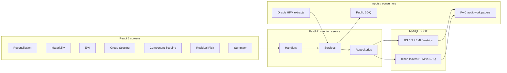

# Architecture — Uber FRM Risk Scoping (campaign PDF sync)

## Resume bullets (current)
1. Owned design/architecture — 8 screens, 30+ APIs, $340M materiality, targeting 70% recon cut.
2. Replaced Sheets close with MySQL SSOT tying HFM to 10-Q for PwC line-level audit trail.
3. Automated group/component scoping + residual-risk + EMI auto-flags across 55 FSLIs / 14 entities ($340M / $170M sample).
4. Led 3 engineers + Bazel pytest suite to 1,100+ tests for PwC-facing releases.

**Removed from PDF (still defend verbally):** 11-table schema list, Sheets→MySQL “18 files” migration wording, column-aliasing bug as a standalone bullet.

## 1. Where each tech is used (and why)

| Tech | Where | Why |
|---|---|---|
| **Python / FastAPI** | 30+ REST APIs for 8 screens | Uber/EPAM Python service norms; async handlers with `asyncio.to_thread` for sync SQLAlchemy |
| **SQLAlchemy 2.0 / Pydantic** | ORM + response trees (L1→L2→L3) | Typed models, explicit `.label()` joins, nested recon/scoping payloads |
| **MySQL** | System of record for scoping + recon leaves | SSOT vs Sheets; durable IDs for audit comments/history |
| **React (Fusion.js)** | 8 UI screens | Finance interactive grids |
| **Handler / service / repository** | Layered backend | Parallelize pod work; testable boundaries |
| **Bazel + pytest** | `uber_py_test` CI gates | ~1,100+ tests before merge |
| **Docker** | Local/CI packaging | Reproducible runs |
| **Header auth** | `x-auth-params-email` | Gateway-injected identity for `created_by` / `updated_by` audit columns |

## 2. Domain model (say this instead of “11 tables”)

Scoping service owns the financial close decision graph:

| Area | What it stores | Screen / outcome |
|---|---|---|
| Balance sheet / income statement facts | FSLI hierarchies by fiscal quarter/year | Group + component scoping |
| EMI | Equity-method investees (ownership %, balances, auditor) | EMI scoping |
| Metrics / thresholds | Materiality, residual threshold, benchmarks | Materiality + Threshold Setup |
| Assessments / questions | Scoping questionnaire state | Assessments |
| Level mapping / component entity | Hierarchy links | Component scoping |
| Recon leaves | HFM vs filed 10-Q amounts + difference | Reconciliation |

**Q4 2025 sample (MEASURED):** group materiality **$340M**, residual **$170M**, ~**55** line items, **14** entities.

If asked “how many tables?”: “About **11 SQLAlchemy models** in the scoping service; collaboration/comments live in a separate service — I do not claim those.”

## 3. Architecture diagram

## 4. End-to-end quarterly flow

1. HFM extracts land in MySQL fact tables for the fiscal period.
2. Recon screen ties HFM amounts to public **10-Q** line amounts (`difference = HFM − filed`).
3. Materiality / thresholds set group materiality (**$340M** sample) and residual (**$170M**).
4. Group scoping marks significant FSLIs; component scoping drills entities under each FSLI.
5. Residual risk computes uncovered balance vs materiality; EMI scopes equity-method investees.
6. Summary feeds **PwC** work papers.
7. Platform **targets** **70%** less manual ingestion/recon time (TDD) — say **targeting**.

## 5. Verbal depth (not on PDF)

### Sheets → MySQL recon (owned)
Parallel v2 endpoints beside v1; 18 files / +1268 LOC; stable UUIDs unlock comments. Cutover after staging parity.

### Column-aliasing bug
Joined fact + `level_mapping` shared column names; `dict(zip(keys, row))` kept last write → wrong UUID. Fix: SQLAlchemy `aliased()` + explicit `.label()` on every projected column.

### Why not claim collaboration service
Comments/Slack live in `frm-collaboration-service`. Scope your ownership to the **scoping service**.
