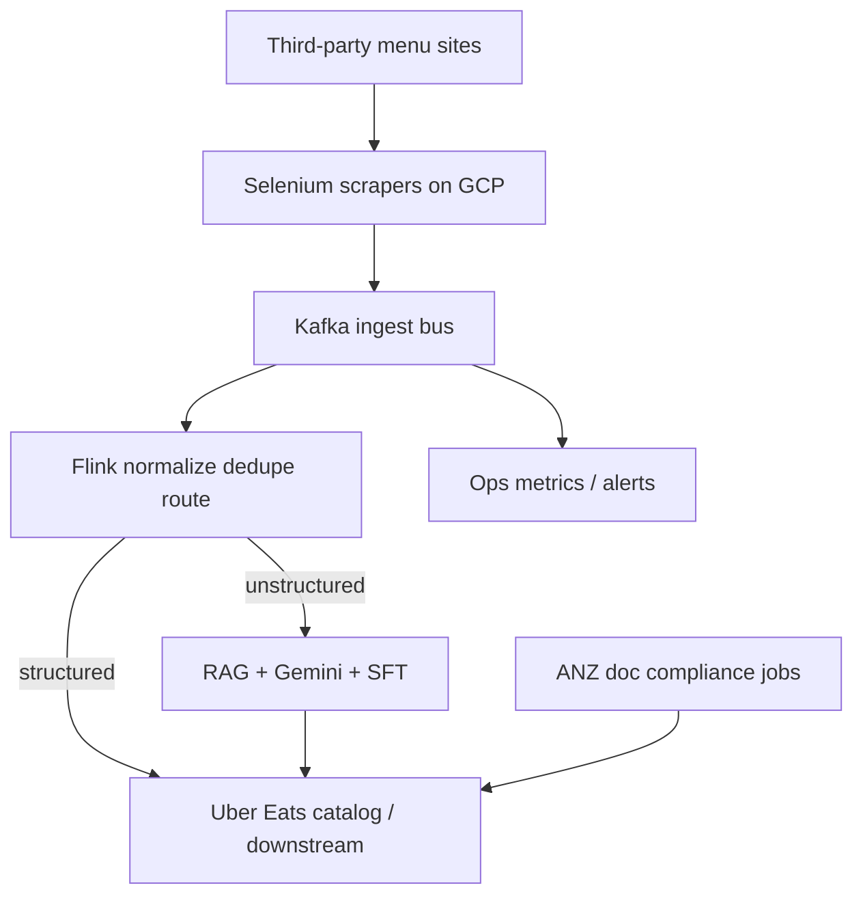

# Architecture — Uber Eats Menu Ingestion

## 1. Where each tech is used (and why)

| Tech | Where | Why |
|---|---|---|
| **Python** | Scrapers, extraction workers, orchestration | Primary language for automation + AI glue |
| **Selenium** | Browser scrape of third-party menu pages | Needed when partner APIs incomplete / HTML-only sources |
| **Kafka** | Replayable **ingest bus** after scrape | Decouple bursty scrapers from downstream; ordered per vendor key; replay on parser bugs |
| **Flink** | Hot-path validate / keyed dedupe / route | Stateful stream processing; event-time for late pages; fresher than Spark micro-batches |
| **RAG + Gemini 2.5 Pro** | Unstructured menus (PDF/image/messy HTML) → structured fields | LLM+retrieval beats brittle regex on wild menus |
| **SFT** | Schema adherence for extraction | Offline eval: **100%** schema consistency, **98%** fidelity |
| **GCP** | Hosting scrapers / jobs / storage | Uber Eats automation footprint on GCP in this workstream |
| **Docker** | Package workers | Repeatable deploys for scraper fleet |
| **IP rotation / proxies / backoff** | Anti-bot layer | Raise successful ingestions to **95%+** |

**Verbal / study only:** Spark backfills, Pinot ops dashboards — not required on PDF.

## 2. Data design (logical)

| Store / topic | Contents |
|---|---|
| Kafka topics | Raw scrape events, retries, health signals keyed by vendor/menu |
| Flink keyed state | Dedupe / ordering state per vendor key |
| Object storage | Raw HTML/PDF/image payloads |
| Structured menu records | Normalized items, prices, modifiers after extract |
| Eval sets | Offline fidelity / schema fixtures for RAG+SFT |
| Compliance docs store | ANZ driver/vehicle documents workflow (sibling automation) |

## 3. Architecture diagram

## 4. End-to-end flow

1. Scraper fleet pulls vendor menus (Selenium), handles anti-bot (rotation, proxies, backoff).
2. Events land on **Kafka** for ordered, replayable ingest (**30K+ menus/month**).
3. **Flink** validates, dedupes (keyed state), routes structured vs unstructured.
4. Structured path → catalog upsert.
5. Unstructured path: **RAG + Gemini + SFT** → schema-valid menu JSON (offline **98% / 100%**).
6. Catalog write-back; ops watch success rate (**95%+**).
7. Outcome: onboarding **24h → 2h**, **$600K+/yr** saved vs ~$2/menu third-party tooling (HISTORICAL).
8. Parallel: ANZ document compliance automation to **99.9%**, **20 h/week** saved.

## 5. Why Kafka here vs Masters Kafka
- **Menu:** absorb scraper bursts + replay bad parses + Flink consumer.
- **Masters:** compliance IRP pipeline with multi-consumer replay and per-GSTIN ordering (no Flink claim).
Same Kafka, different domain contracts — be ready to compare.

## Related
- [../tech_depth/flink.md](../tech_depth/flink.md)
- [../deployment_and_scale.md](../deployment_and_scale.md)
