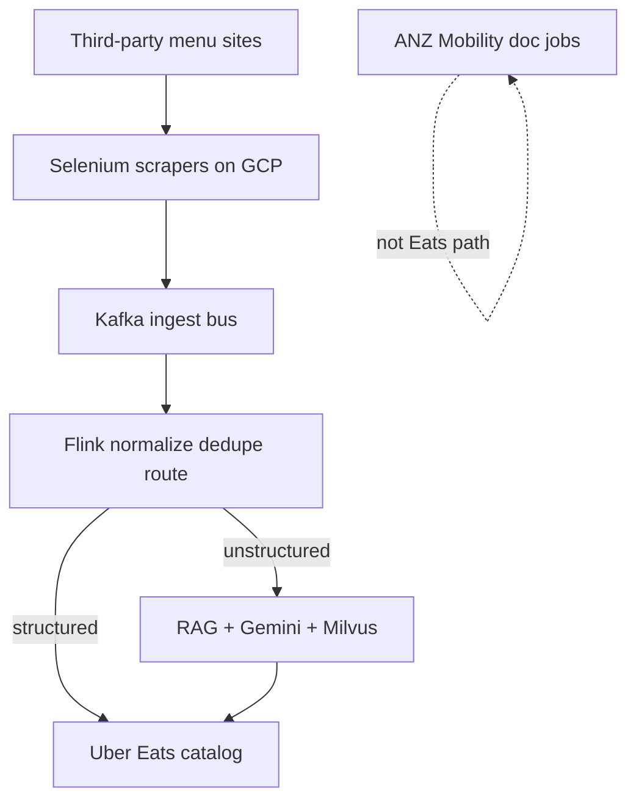

# Architecture — Uber Eats Menu Ingestion

## 1. Where each tech is used (and why)

| Tech | Where | Why |
|---|---|---|
| **Python** | Scrapers, extraction workers, orchestration | Primary language for automation + AI glue |
| **Selenium** | Browser scrape of third-party menu pages | Needed when partner APIs incomplete / HTML-only sources |
| **Kafka** | Replayable **ingest bus** after scrape | Decouple bursty scrapers from downstream; ordered per vendor key; replay on parser bugs |
| **Flink** | Hot-path validate / keyed dedupe / route | Stateful stream processing; event-time for late pages |
| **LangChain RAG + Gemini 2.5 Pro + Milvus** | Unstructured menus (PDF/image) → Uber Eats schema | Retrieval grounds extraction; Gemini generates; Milvus holds similar labeled menus |
| **GCP** | Hosting scrapers / jobs / storage | Uber Eats automation footprint on GCP in this workstream |
| **Docker** | Package workers | Repeatable deploys for scraper fleet |
| **IP rotation / proxies / retries** | Anti-bot layer | Raise successful ingestions to **95%+** |

**Honesty:** **98% fidelity / 100% schema** = offline eval. **ANZ** is Mobility docs — not the Eats menu pipeline.

## 2. Data design (logical)

| Store / topic | Contents |
|---|---|
| Kafka topics | Raw scrape events, retries, health signals keyed by vendor/menu |
| Flink keyed state | Dedupe / ordering state per vendor key |
| Object storage | Raw HTML/PDF/image payloads |
| Milvus | Embeddings of labeled menu chunks for RAG |
| Structured menu records | Normalized items, prices, modifiers after extract + schema gate |
| ANZ docs store | Driver/vehicle compliance (sibling automation) |

## 3. Architecture diagram

### ASCII (whiteboard)

```
 3rd-party platforms (HTML, PDF, images)
        │  Selenium + IP rotation / proxies / retries
        ▼
 ┌─────────────────────┐
 │   Kafka (ingest bus)│◄──────── replay / backfill
 └─────────┬───────────┘
           ▼
 ┌───────────────────────────┐
 │ Flink normalization       │
 │ · schema validate         │
 │ · keyed dedupe            │
 │ · route structured vs not │
 └─────┬───────────────┬─────┘
       │ structured    │ unstructured (PDF/image)
       ▼               ▼
 catalog upsert   ┌────────────────────────┐
                  │ LangChain RAG          │
                  │ Gemini 2.5 Pro         │
                  │ Milvus retrieve        │
                  │ schema gate → human?   │
                  └──────────┬─────────────┘
                             ▼
                      Uber Eats catalog

 ANZ Mobility (separate): driver/vehicle docs → 99.9% · ~20h/week HISTORICAL
```

### Mermaid



## 4. End-to-end flow

1. Scraper fleet pulls vendor menus (Selenium), handles anti-bot.
2. Events land on **Kafka** (**30K+ menus/month**).
3. **Flink** validates, dedupes, routes structured vs unstructured.
4. Structured → catalog upsert.
5. Unstructured: **RAG + Gemini + Milvus** → schema-valid JSON (offline **98%/100%**).
6. Ops watch success (**95%+**). Outcome: **24h → 2h**, **$600K+/yr**.
7. Parallel: ANZ document compliance (**Mobility**).

## 5. Why Kafka here vs Masters Kafka
- **Menu:** absorb scraper bursts + replay bad parses + Flink consumer.
- **Masters:** compliance IRP pipeline with multi-consumer replay and per-GSTIN ordering.
Same Kafka, different domain contracts.

## Related
- [../tech_depth/flink.md](../tech_depth/flink.md)
- [../deployment_and_scale.md](../deployment_and_scale.md)
