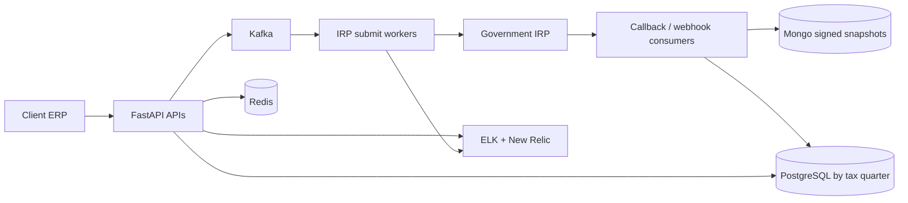

# Architecture — Masters India GST / E-Invoicing

## 1. Where each tech is used (and why)

| Tech | Where | Why |
|---|---|---|
| **Python / FastAPI** | Microservices replacing PHP Laravel (gradual cutover) | Async-friendly APIs; filing-day safe canary cutover |
| **Kafka** | Bulk e-invoice / IRP async stages | Ordering per taxpayer, durable replay, multiple consumer groups |
| **PostgreSQL** | Transactional data split by **tax quarter** | Hot/cold by fiscal quarter; query and retention fit GST |
| **MongoDB** | Document snapshots of signed IRP responses | Flexible payload storage for IRN/QR artifacts |
| **Redis** | Caching for hot reads | Cut repeat DB reads **~30%** |
| **Elasticsearch** | Search / log analytics with ELK | Incident triage and support lookups |
| **Celery** | Scheduled/background tasks | Cron-like work that is not stream semantics |
| **ELK + New Relic** | On-call alerting and APM | Triage **~70%** faster; production visibility |
| **Docker / AWS** | Deploy and cloud | Org standard for services |

## 2. Database / partition design

- **Quarter sharding (PostgreSQL):** partition or shard keys aligned to GST filing quarters so large history does not poison hot paths.
- **Idempotency keys:** client + file hash + batch index (and unique business refs) to prevent double IRP registration.
- **DLQ:** poison / failed IRP messages for safe replay after fix.
- **Redis:** cache frequently read master/config data; accept invalidation complexity.

## 3. Architecture diagram

### ASCII (whiteboard)

```
 Client ERP / Dashboard
        │
 ┌──────▼────────────────────────────────┐
 │ Gateway canary (% FastAPI | PHP)      │
 └──────┬────────────────────────────────┘
        ▼
 FastAPI services (submit · bulk · recon)
        │
   ┌────┼──────────┬────────────┐
   ▼    ▼          ▼            ▼
  PG   Redis    Kafka        MongoDB
 (by   cache   (chunks ·     (IRN/QR
 tax          IRP · hooks)   snapshots)
 qtr)
        │
        ▼
 Workers ── idempotency + retries + DLQ ──► Government IRP
        │
   ELK + New Relic
```

### Mermaid



## 4. End-to-end flow

1. Client posts invoice JSON (or bulk file) to FastAPI.
2. Validate schema/GSTIN; accept import chunks.
3. Kafka carries submit jobs; workers call government **IRP**.
4. Signed e-invoice (IRN/QR) persisted; webhooks fan out.
5. Idempotency + DLQ prevent double-filing and allow replay.
6. Outcomes: **1M+ IRP/day**, **100K+/import**, throughput **700 → 4,000 req/min**, p95 **1.2s → 300ms** for **1,500+** clients; mentored **2**; coverage **35% → 82%**; deploy success **98%** (HISTORICAL).

## 5. Gradual migration note (strangler verbally)
PHP monolith stays behind the gateway while FastAPI services cut over by domain with canaries — interviewers may call this *strangler*; PDF says migrated to microservices.
