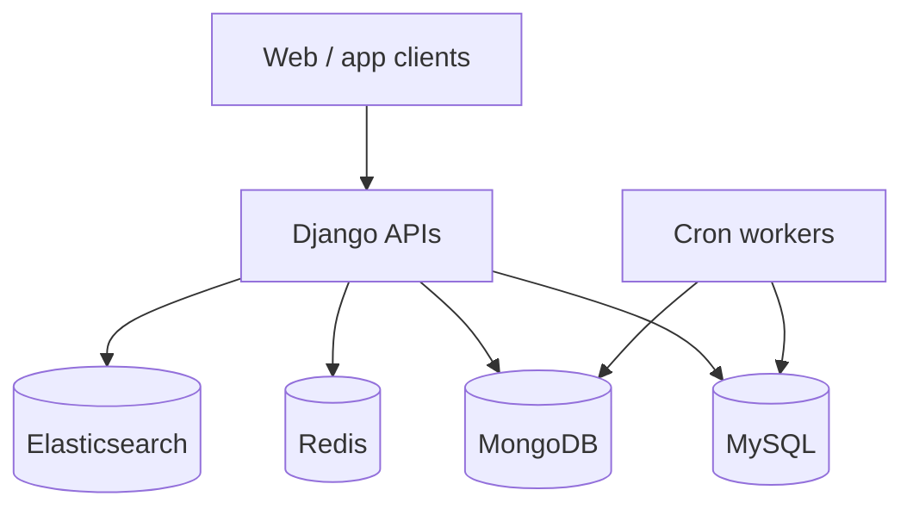

# Architecture — GeeksforGeeks Doubt / Platform Backend

## 1. Where each tech is used (and why)

| Tech | Where | Why |
|---|---|---|
| **Python / Django** | Doubt-support backend after PHP migration | Faster feature velocity, ORM, auth ecosystem for content/community product |
| **MySQL** | Primary relational data (users, votes, pins, courses) | Transactional consistency for premium/subscription related writes |
| **MongoDB** | Flexible documents where schema varied | Rapid content/metadata shapes without heavy migrations |
| **Redis** | Caching / rate-ish hot paths | Protect DB under **10×** contest spikes |
| **Elasticsearch** | Search over doubts/content | Full-text findability beyond SQL `LIKE` |
| **Cron pipelines** | Video processing, reminders, recording cleanup | Batch ops efficiency (**+70%** ops) |

## 2. Data design (logical)

| Store | Entities |
|---|---|
| MySQL | Users, subscriptions, votes, pins, course purchase facts |
| MongoDB | Semi-structured content / influencer analytics payloads |
| Redis | Hot keys for feed/contest burst |
| Elasticsearch | Doubt/search index |

## 3. Architecture diagram

### ASCII (whiteboard)

```
 Web / app
    │
    ▼
 Django REST  (after PHP → Django)
    │
 ┌──┼────┬───────┬──────────┐
 ▼  ▼    ▼       ▼          │
MySQL Mongo Redis Elasticsearch
    │
    ▼
 Cron: video · reminders · cleanup     (+70% ops)
 Influencer dashboard                   (+30% course sales)
 Votes / pins / locks                   (+15–20% premium)
```

### Mermaid



## 4. End-to-end flows

### Doubt reliability
PHP → Django migration stabilized **10K+ daily queries** and **10×** contest spikes (standardized scale).

### Growth features
Voting/pinning APIs → **15–20%** premium subscription lift (HISTORICAL relative).

### Influencer / video ops
Dashboard + cron video pipelines → **+30%** course sales, **+70%** ops efficiency (HISTORICAL).

## 5. Interview tip
Keep GFG as early-career ownership: migration + APIs + crons. Do not oversell scale vs Masters/Uber/IA.
