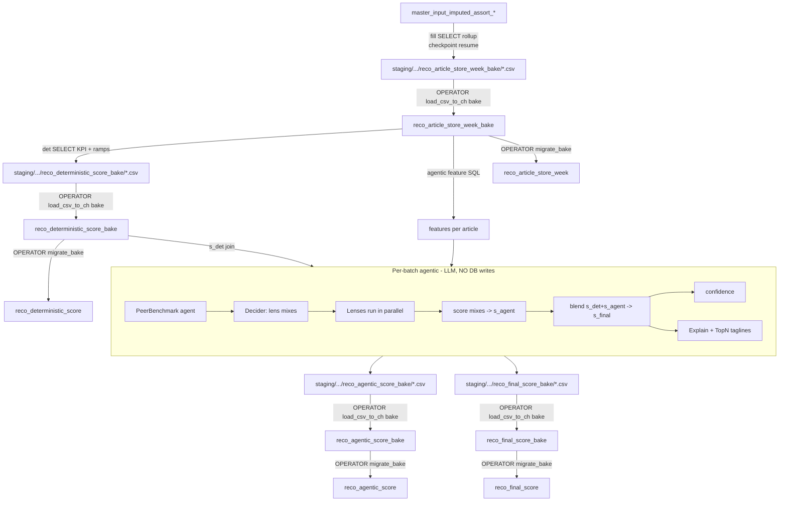
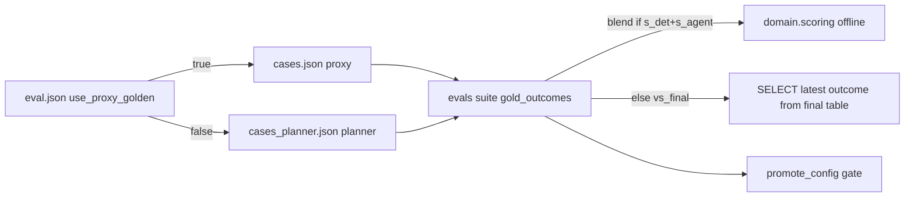

# Assort Keep/Drop flow (`assort_kd_flow`) — Deep End‑to‑End Pipeline Reference

Hybrid **Keep / Drop** decisioning at **article × plan‑season** grain, combining a
deterministic rule score (`s_det`) with an agentic LLM score (`s_agent`) into a
final blended score (`s_final`). Outcomes are **binary: keep or drop** (no "shop").

This document explains every stage: what it does, why it exists, the SQL it runs,
the maths, the config it reads, the agents involved, prompts, guardrails,
timeouts/retries, evals, and how to run it in production — with worked examples.

> **Package note.** `assort_kd_flow` is the only Keep/Drop package in this repo
> (former `assortment/` / `assortment_v2` names retired). It is **self-contained**
> for config, prompts, agents, engines, and CH clients (shared only: repo `.env` +
> ClickHouse). It has a pure `domain/` math layer, offline `evals/`, `ops/` helpers,
> a prompt registry, and Critic/Evaluator disabled. **All engines write staging
> CSVs only.** Ops loads bake via `python -m assort_kd_flow.ops.load_csv_to_ch
> --target bake`, then promotes with `python -m assort_kd_flow.ops.migrate_bake`.
> Config `source.*_table` defaults point at `*_bake` for mid-run reads; `*_table_main`
> names are for promote. Evals grade whatever `source.final_table` names (bake by default).

---

## 0. Mental model in one paragraph

For each article in a season we compute a rule score from sell‑through and rate of
sale (`s_det`), and an LLM score from a set of analytical "lenses" combined by a
per‑article "decider" (`s_agent`). We blend them: `s_final = 0.4·s_det + 0.6·s_agent`.
Keep if `s_final ≥ 0.55`. Everything is config‑driven; formulas live in `domain/`;
LLM behaviour is bounded by guardrails; quality is checked offline by `evals/`.

---

## 1. Architecture layers

```
assort_kd_flow/
  config/decision.json     # weights, ramps, lenses, agents, guardrails  (the knobs)
  config/eval.json         # promotion gates
  domain/                  # PURE math + rules (no I/O, no LLM)
    kpis.py                #   KPI formulas + SQL exprs (single source of truth)
    scoring.py             #   ramps, s_det, s_final, confidence, mixes
    rules.py               #   binary outcome, demand>margin, cutover matrix
  context/                 # what each agent is allowed to see (ranked fields)
  prompts/registry.py      # prompt id -> path
  prompts/md/              # base + lens + decider + explain + topN + peer prompts
  lenses/
    features.py            # feature SQL from reco_article_store_week
    gate.py                # cheap prefilter: which lenses apply to an article
  agents/
    tool_agent.py          # LangGraph ToolNode loop (bounded)
    peer.py                # PeerBenchmark agent (relative context)
    critic.py, evaluator.py# DISABLED in v2 (replaced by offline evals)
  engines/
    deterministic.py       # s_det SQL engine
    decider.py             # per-article lens mixes
    agentic.py             # orchestration: scopes, parallelism, resume
    agentic_batch.py       # per-batch: peer -> decider -> lenses -> blend -> explanations
    ensemble.py            # re-exports domain.scoring (compat)
    confidence.py          # re-exports domain.scoring (compat)
    explain.py             # planner-facing Keep/Drop explanation JSON
    topn_explain.py        # short Top Performing card tagline for Keeps
    run_ensemble.py        # patch s_det/s_final only (no LLM)
  fill/
    article_store_week.py  # master_input → week bake CSV (SELECT only)
    detect_new.py          # watermark: which l1×l2×week changed
  ch/, tools/, settings/, llm.py
  evals/                   # offline gold suite + post-run report
  ops/                     # load_csv_to_ch, migrate_bake, promote_config, run_controller
  logs/                    # run ledgers only (<run_id>/events.jsonl + summary.json)
  run_pipeline.py          # CLI
```

**No LLM orchestrator.** Batch order is fixed in `engines/agentic_batch.py`
(peer → decider → lenses → blend → explain → topN explain). Run-level oversight is deterministic
`ops/run_controller.py` (ledger, circuit breaker, signal-quality abort) — not an agent.

**Design rule:** KPI/ramp/ensemble/confidence maths exist **once** in `domain/`.
SQL generators and Python tests both call the same functions, so the number a
planner sees and the number a test checks can never silently diverge.

---

## 2. Tables (ClickHouse, database `kik_dev`)

| Table | Grain | Written by | Purpose |
|---|---|---|---|
| `master_input_imputed_assort_*` | article × store × **date** | upstream (read‑only) | raw sales + inventory |
| `reco_article_store_week_bake` | article × store × **fiscal_year_week** | `load_csv_to_ch` (from fill CSV) | bake week rollup (`approved`) |
| `reco_deterministic_score_bake` | article × plan‑season | `load_csv_to_ch` (from det CSV) | bake `s_det` + `approved` |
| `reco_agentic_score_bake` | article × plan‑season | `load_csv_to_ch` (from agentic CSV) | bake `s_agent` + `approved` + `l0`–`l4` |
| `reco_final_score_bake` | article × plan‑season | `load_csv_to_ch` (from final CSV) | bake finals + `approved` |
| `reco_article_store_week` / `reco_deterministic_score` / `reco_agentic_score` / `reco_final_score` | same grains | `migrate_bake` | main tables after promote |

| `global.fiscal_date_mapping`, `global.season_master` | calendar | upstream | maps `fiscal_year_week → plan_season_code` |

Since `output.mode = csv`, **all engines write staging CSVs only** (exact table
columns + staging-only `ch_load_status`). Publish path:

1. `ops.load_csv_to_ch --target bake` (default) → `*_bake`
2. `ops.migrate_bake` → main (`approved=1` on bake)

Operator order for a fresh season: fill CSV → load week bake → det CSV → load
det bake → agentic CSV → load agentic/final bake → migrate when ready.
`output.mode` `clickhouse`/`dual` requires ops `--dangerous-write-ch` — agents
never get that flag. Host `resource_budget` caps workers and pool size.
Staging lives under `assort_kd_flow/staging/<run_id>/`. Fill resume is
checkpoint JSON by year×l1×l2.
**Critical calendar note:** `season_code` has one meaning across the week,
deterministic, agentic, and final tables: the Kik plan season (e.g. 74/76).
The fill maps it once from `fiscal_year_week` via
`global.fiscal_date_mapping → global.season_master`; scoring propagates that
stored key directly. The source product-fashion value (0–4) is retained only as
`reco_article_store_week.product_season_code`.

**Provenance columns.** Every `reco_*` row carries `config_hash` (SHA‑256 of the
config JSON **and** all referenced prompt files) and `computed_at`. Uniqueness /
resume is by `(season_code, article)` (latest `computed_at`), not a run UUID.
`reco_deterministic_score` also stores `matched_terms` + `reason_codes` +
`det_reason`; `reco_agentic_score` stores per‑lens `lens_results` and
`agent_status` (`ok`/`pending`/`error`); `reco_final_score` stores `outcome`,
Keep/Drop `explanation`, Top Performing `explanation_topN`, and
`explanation_json`. Score tables also carry the **product hierarchy**
`l0_name`…`l4_name` (denormalized from the week table; one article → one path).
Store hierarchy (`s0`/`s1`/`region`) stays on the week table only — score grain
is article×season, not store. Because `config_hash` folds in prompt text, editing
any prompt changes the hash — you can always tell which config+prompts produced a
row.

---

## 3. Prerequisites before a run

1. **ClickHouse access** via `.env` (`CLICKHOUSE_HOST`, `_PORT`, `_USER`,
   `_PASSWORD`, `_DATABASE`, `_SECURE`). App is **SELECT/INSERT only** — never DDL.
   Schema (`reco_*` tables, incl. `explanation_json`) is applied out‑of‑band by a
   privileged user.
2. **LLM access** via `.env` (OpenAI/Azure/Anthropic/etc.); `assort_kd_flow/llm.py`
   builds a model per call (no global singleton).
3. **Source populated:** `master_input_imputed_assort_*` for the target fiscal
   years, containing `units_sold, revenue, margin, cost, msrp, discount_percentage,
   oh, oh_cost, eop_inv, bop_inv, receipts_quantity, …`.
4. **Calendar populated:** `global.fiscal_date_mapping` + `global.season_master`
   covering those weeks (so plan seasons resolve).
5. **Config chosen:** `assort_kd_flow/config/decision.json` (weights, ramps, active
   lenses, guardrails). Its `config_hash` is stamped on every output row.

> Data reality that shaped v2: in the Kik feed `eop_inv`/`bop_inv` are **all zero**,
> but daily on‑hand `oh` is populated ~71%. So sell‑through uses **ending on‑hand**
> as residual stock, clamped ≥ 0. See §6.

---

## 4. End‑to‑end flow



Fixed order: **fill → deterministic → agentic → (ensemble optional) → evals.**
`--steps auto|all` expands to `fill, deterministic, agentic, evals`.

**Write model (who writes ClickHouse):**

| Stage | Writes CH? | Artifact | Resume mechanism |
|---|---|---|---|
| `fill` | **No** (CSV only) | `reco_article_store_week_bake/*.csv` | checkpoint JSON (`year×l1×l2`) |
| `deterministic` | **No** (CSV only; optional `--dangerous-write-ch`) | `reco_deterministic_score_bake/*.csv` | staging `ch_load_status` |
| `agentic` / `final` / explain / topN | **No** (CSV only) | staging bake CSVs | `agent_status='ok'` (manifest) |
| **publish** `load_csv_to_ch` | **Yes** (operator) | `*_bake` (default) or main | `ch_load_status=ok` skip |
| **promote** `migrate_bake` | **Yes** (operator) | main tables | unapproved bake rows |

- **No LLM agent ever writes ClickHouse.** Agent tools are SELECT-only
  (`tools/ch_read.py`), and sinks are forced to CSV unless an operator
  passes `--dangerous-write-ch` (§18.3).
- Publishing CSVs to ClickHouse is **not** a pipeline step — it is a separate
  operator command (§16).
- Every write script honors the host `resource_budget` (~50% CPU/RAM/pool by
  default; §18.2).

---

## 5. STEP: fill  (`fill/article_store_week.py`)

**What:** aggregate `master_input` daily rows → staging CSVs for
`reco_article_store_week_bake` (article × store × fiscal_year_week). Publish with
`load_csv_to_ch` then `migrate_bake`.

**Why:** scoring never touches raw daily data; the weekly rollup is the single
fact table for KPIs and features. Chunked by year × (l1,l2) because a full‑year
GROUP BY OOMs on Cloud (~14 GiB).

**Key SQL (per year × l1 × l2), simplified:**

```sql
SELECT
  calendar.plan_season_code AS season_code,
  anyLast(toInt64(coalesce(m.season_code,0))) AS product_season_code,
  m.fiscal_year_week, m.fiscal_year, m.article, m.store_code,
  anyLast(...) AS <dims>,                 -- style, color, l1..l4, channel, etc.
  sum(m.units_sold)               AS qty,
  sum(m.revenue)                  AS revenue,
  sum(m.margin)                   AS margin,
  avgWeighted(m.discount_percentage, greatest(m.revenue,0)) AS discount_pct,
  sum(coalesce(m.receipts_quantity,0)) AS receipts_qty,
  argMinIf(m.bop_inv, m.date, m.bop_inv IS NOT NULL) AS bop_units,
  argMaxIf(m.eop_inv, m.date, m.eop_inv IS NOT NULL) AS eop_units,
  sum(coalesce(m.oh,0))           AS oh_units_daysum,   -- daily on-hand summed
  sum(coalesce(m.oh_cost,0))      AS oh_cost_daysum,
  countIf(coalesce(m.oh,0)!=0)    AS oh_days_cnt,       -- days with on-hand
  ...
FROM kik_dev.master_input_imputed_assort_1_textil AS m
INNER JOIN (
  SELECT f.fiscal_year_week, any(s.season_code) AS plan_season_code
  FROM global.fiscal_date_mapping AS f
  INNER JOIN global.season_master AS s ON s.name = f.fiscal_season_name
  GROUP BY f.fiscal_year_week
) AS calendar ON calendar.fiscal_year_week = m.fiscal_year_week
WHERE m.fiscal_year IN (...) AND m.article!='' AND m.store_code!=''
GROUP BY calendar.plan_season_code, m.fiscal_year_week, m.fiscal_year,
         m.article, m.store_code
```

(Engines run SELECT only; CH INSERT is ops `load_csv_to_ch`.)

Before deleting or inserting, fill aborts if any selected source fiscal week has
no calendar mapping. This prevents silently missing or mis-seasoned facts.

**Standalone module + pipeline invoke.** `fill/run_fill.py` (`run_fill(...)`) is
the entrypoint the pipeline calls; you can also run it directly
(`python -m assort_kd_flow.fill.run_fill`). It is a **CSV-only script write** —
no agent, no default CH insert. Publish with `load_csv_to_ch` / `migrate_bake`.

**Resume (checkpoint).** Each completed `year × l1 × l2` scope is appended to a
checkpoint JSON under the run's `fill_checkpoints/` (or a legacy staging path).
`--resume` skips scopes already recorded. Default checkpoint path can be
overridden with `--checkpoint`. Pass `--run-id` to pin the staging folder.

**Guards:** `max_execution_time=600`, external group‑by + memory caps;
`AdaptivePool` runs scopes in parallel (`max_parallel_fill_scopes`, dial‑down on
failure, `fill_retries`) — capped by `resource_budget.max_workers` (§18.2); each
worker gets its **own** CH client (thread‑safety). CH year DELETE / INSERT happen
only in ops publish/promote (not in fill).

**Incrementality — `detect_new.py`:** compares `master_input` vs the configured
week table (`source.week_table`, bake by default) per `l1 × l2 × fiscal_year_week`
(a watermark). Only "dirty" scopes are re‑filled, then deterministic/agentic
cascade to those scopes. Enables crash‑safe, cheap re‑runs when new sales land.

**Existing-table migration (manual, out of band):**

```sql
ALTER TABLE kik_dev.reco_article_store_week
    ADD COLUMN IF NOT EXISTS product_season_code Int64 AFTER season_code;
```

After deploying the updated fill, rerun it in replace mode for **every fiscal
year already present**. Existing rows cannot be reused: their `season_code`
contains the old product-fashion value. Do not run deterministic/agentic until
the refill finishes and all week rows carry mapped plan seasons. The application
does not execute this DDL; see `ch/schema.sql`.

---

## 6. STEP: deterministic  (`engines/deterministic.py`)

**What:** compute `s_det` + KPIs per article × plan‑season → staging
`reco_deterministic_score_bake` CSV (publish via load/migrate).

**Why:** a fast, transparent, auditable rule score that anchors the blend and
gives explainable reason codes. It is intentionally **not** the final word — the
agentic layer refines borderline cases.

### 6.1 KPIs (single source: `domain/kpis.py`, SQL mirrored in engine)

| KPI | Formula | Notes |
|---|---|---|
| `sell_thru_eop_pct` | `100·qty / (qty + residual)` | `residual = max(0, max(eop_units, end_oh_units))` |
| `ros` (rate of sale) | `qty / store_week_cnt` | units per selling store‑week |
| `woh` (weeks of cover) | `avg_on_hand / weekly_sales` | clamped ≥ 0 |
| `gm_pct` | `100·margin / revenue` | stored, not scored today |
| `sell_thru_pct` | `100·qty / (bop + receipts)` | weak: bop empty in feed |

`end_oh_units` = per store, last week's average daily on‑hand
(`argMax(oh_units_daysum/oh_days_cnt, fiscal_year_week)`), summed across stores.
This is the fix for the empty‑`eop_inv` problem: without it every article read
100% sell‑through and the signal carried no information.

### 6.2 Ramp normalization (`domain/scoring.normalize_signal_value`)

Each KPI maps to [0,1] piecewise‑linear with knobs **low / target / high**:

```
x ≤ low                    -> 0
low < x < target           -> target_score · (x-low)/(target-low)
target ≤ x < high          -> target_score + (1-target_score)·(x-target)/(high-target)
x ≥ high                   -> 1
```

Current config:

| signal | weight | low | target | high | target_score |
|---|---|---|---|---|---|
| sell_thru_eop_pct | 0.55 | 50 | 85 | 98 | 0.6 |
| ros | 0.45 | 0.5 | 1.0 | 1.5 | 0.6 |

### 6.3 s_det

```
s_det = Σ(weight · ramp(metric)) / Σ(weight)
s_det = max(s_det, structural_floor[PLC])        # Basics≥0.85, NOS≥0.90
s_det = clip(s_det, 0, 1)
det_outcome = keep if s_det ≥ det_keep_threshold (0.65) else drop
```

**Worked example:** ST=84 → ramp = 0.6·(84−50)/(85−50)=0.583; ROS=1.168 →
0.6+0.4·(1.168−1.0)/0.5=0.734; `s_det = (0.55·0.583 + 0.45·0.734)/1.0 = 0.65` → keep.

### 6.4 Terms (reason codes, `deterministic.terms`)

The **score** comes from the signals+ramps above. Separately, `terms` produce
human‑readable **reason codes** for explainability (they don't change `s_det`
under `weighted_continuous`; they annotate *why* an article looks keep‑worthy):

| term id | condition | reason code |
|---|---|---|
| `mandatory` | `is_mandatory = 1` | `DET_MANDATORY` |
| `plc` | `product_life_cycle ∈ {Basics, NOS}` | `DET_PLC_KEEP` |
| `st_ge` | `sell_thru_eop_pct ≥ 65` | `DET_ST_GE_65` |
| `ros_ge` | `ros ≥ 1.0` | `DET_ROS_GE_1` |
| `st_ros_combo` | `ST ≥ 50` AND `ROS ≥ 0.5` | `DET_ST_ROS_COMBO` |

`structural_floors` **do** raise the score: Basics `s_det ≥ 0.85`, NOS `≥ 0.90`,
so lifecycle staples are never dropped by the rule layer even on a soft season.
`default_outcome = drop` means anything not clearing `det_keep_threshold` (0.65)
is a rule‑drop before the agent sees it.

### 6.5 Quality gate (why v2 won't silently degrade)

Before scoring, `assess_signal_quality` computes each KPI **fresh from the week
table** (via the shared `build_kpi_select_sql`) and checks:

- `usable_fraction` ≥ `min_usable_fraction` (values finite and in range)
- `boundary_fraction` ≤ `max_boundary_fraction` (not piled on one value)

If a signal fails (e.g. 99.6% of articles at ST=100), it is **disabled for the
run** and logged loudly, so a broken signal can't dominate `s_det` at full weight.
`check_signal_quality` also reports post‑hoc breaches in the run summary.

> Lesson baked in: the gate must read the **freshly computed** KPI, not the
> previously stored column — otherwise a formula change is invisible to the gate.

### 6.6 CSV-first write (script)

Deterministic is a **standalone write script** (`run_deterministic`, invoked by the
pipeline). Per scope it runs the scoring `SELECT` (the old `INSERT … SELECT` body
without the `INSERT` prefix), writes rows to
`staging/<run_id>/reco_deterministic_score_bake/` with `ch_load_status=pending`
and `approved=0`. Publish with `load_csv_to_ch --tables deterministic --target bake`,
then `migrate_bake --tables deterministic`.

- Default is CSV-only (`write_to_ch=False`). Ops `--dangerous-write-ch` can still
  insert main directly (not the recommended path).
- Agentic reads `s_det` from `source.deterministic_table` (bake by default) — load
  det bake before agentic on a fresh season.

**Guards:** parallel scopes via `AdaptivePool` capped by `resource_budget.max_workers`
(§18.2); per‑thread CH clients (`new_ephemeral_client`, small pool); optional season
delete before insert; `config_hash`/`rule_version` stamped.

---

## 7. STEP: agentic  (`engines/agentic.py` + `agentic_batch.py`)

**What:** produce `s_agent` (and `s_final`, confidence, explanation) per article
using LLM lenses combined by a per‑article decider, with peer context.

**Why:** rules alone are coarse and over‑keep. The agentic layer reads richer
signals (size curve, colour cannibalization, trend, discount dependency, channel,
multi‑season, margin) and does most of the real cutting on borderline items.

### 7.0 Feature build (`lenses/features.py`)

Per scope, one SQL (`build_batch_features_sql`) aggregates the week table into one
row per article for the plan season: `qty, revenue, margin, discount_pct_avg/max`,
KPIs (`sell_thru_eop_pct`, `ros`, `gm_pct`), gate counts (`size_count`,
`channel_count`, `store_count`, `style_color_count`, `season_count`,
`weeks_on_sale`), and a `week_series` array (weekly qty + discount) for the
time‑series lenses. `compact_features_for_lens` then trims this to only the fields
a given lens needs (and only the last 12 weeks for trend/discount lenses) to keep
prompts small.

**Sell‑through is now aligned to `domain/kpis.py`.** Lens features use the same
on‑hand‑fallback sell‑through as deterministic scoring
(`residual = max(0, max(eop, end_oh))`), via `sell_thru_eop_sql_expr` +
`end_oh_units_sql_expr`. (Previously lens features used the naive `qty/(qty+eop)`,
so lenses saw ~100% ST while rules saw the real number — that divergence is fixed.)

### 7.1 Orchestration & parallelism (`agentic.py`)

- Enumerate plan seasons and `l1×l2` scopes.
- Parallel knobs (guardrails): `max_parallel_seasons`, `max_parallel_scopes_per_season`,
  `max_parallel_batches_per_scope`, `max_inflight_llm` (global semaphore).
- Articles chunked into batches of `max_articles_per_llm_batch` (64). Every
  structured LLM call (peer, decider, each lens, explain, topN explain) covers
  that same chunk. TopN explain filters the chunk to Keep rows before calling.
  Peer tool budget = `max_peer_tool_calls` (**2**) for the **whole batch**;
  batch tools (`get_sibling_colours_batch`, `get_scope_benchmarks_batch`) return
  peer data for **all** articles in one SELECT each.
  Forecast metadata (`forecast_targets`) is the same retail season type in the
  next two years **after the scored season's own year**; `forecast.current_year`
  overrides that anchor only when explicitly set (it is `null` by default, so
  wall-clock date never shifts the targets).
  Optional `trend_provider` (Google Trends, off by default) attaches category
  (l1×l2) summaries once per season scope; sales `week_series` / `sales_momentum`
  are always available.

**`sales_momentum` (computed, not LLM prose)** — `domain/momentum.py` derives
per-article, in-season trend structure that the lenses must cite:

| field | meaning |
|---|---|
| `direction` | `rising` / `stable` / `declining` / `insufficient` (slope + early-vs-late qty) |
| `phase` | `emerging` (peak still ahead), `peaking` (topped out), `declining`, `stable`, `insufficient` |
| `peak_week_index` | peak's ordinal week within the season → *when* to expect the peak in a corresponding future season |
| `peak_position` | 0.0 = peaked at season open, 1.0 = still climbing at season close |
| `early_qty` / `late_qty` / `slope` | the underlying half-season velocities |

`phase` is the answer to "which trend is starting vs already peaked";
`peak_week_index` transfers that timing to the `forecast_targets` seasons.
Anything beyond this (external fashion trends) needs the Trends provider.
- **Per‑thread CH clients** and a dedicated **tool client per batch** (the shared
  client crashes on concurrent queries).
- **Resume:** `_load_done_articles` (per season) skips already‑written articles;
  SIGTERM/SIGINT = graceful stop, next `--resume` continues. A failed batch never
  fails the scope; failures land as `pending` for a later resume.

### 7.2 Per‑batch sequence (`agentic_batch.score_batch_decider_final`)

```mermaid
sequenceDiagram
  participant B as Batch (≤64 articles)
  participant Pe as Peer agent
  participant De as Decider
  participant Le as Lenses (parallel)
  participant Sc as Scoring
  participant Ex as Explain + TopN
  B->>Pe: features + ≤max_peer_tool_calls batch tools -> sibling/scope context (all articles)
  B->>De: features + allowlisted lenses -> adaptive mixes/article
  De->>Le: 2 fixed anchors + 2-3 adaptive mixes; unique gate-eligible lenses
  Le-->>Sc: per-lens score/outcome/confidence
  Sc->>Sc: validate mix coverage -> configured aggregate -> s_agent
  Sc->>Sc: blend s_det -> s_final; compute confidence
  Sc->>Ex: rows -> explanation + explanation_topN (LLM on)
  B-->>CSV: staging reco_agentic_score_bake + reco_final_score_bake (ch_load_status=pending)
```

The batch writes **CSV only** (no direct DB write). Publish is the operator
`load_csv_to_ch` step (§16); direct CH bake needs ops `--dangerous-write-ch` (§18.3).

### 7.3 Lens gate (`lenses/gate.py`) — how lenses are picked

A cheap prefilter runs **before** any LLM call; a lens only runs if the article
has the data to make it meaningful:

| Lens | Runs only if |
|---|---|
| colour_cannibalization | `style_color_count ≥ 2` |
| size_curve | `size_count ≥ 2` |
| channel_divergence | `channel_count ≥ 2` |
| multi_season_consistency | `season_count ≥ 2` |
| trend_velocity | `weeks_on_sale ≥ 3` |
| discount_dependency | `discount_pct_avg > 0` or `max > 0` |
| margin_resilience | always |
| spatial_variance | `store_count ≥ 3` (currently inactive) |

**Example:** a single‑colour, single‑size sock sold in one channel for 2 weeks
→ gate allows only `margin_resilience` (+ trend if ≥3 weeks). No wasted LLM calls
on colour/size/channel lenses that have nothing to compare.

### 7.4 Decider (`engines/decider.py`) — lens mixes

The Decider LLM proposes adaptive weighted mixes of allowlisted lenses per
article. Python then constructs the final **4–5 mix hybrid plan**:

1. two deterministic anchors (demand and risk/cannibalization),
2. two or three distinct adaptive Decider mixes,
3. deterministic eligible-lens fallback mixes if adaptive output is missing.

This keeps useful per-article adaptation without allowing one LLM call to own the
whole ensemble. Output is validated:
- unknown lens ids dropped, duplicates removed, ≤ `max_lenses_per_mix` (5),
- weights renormalized to sum 1 and restricted to the article's **gate-eligible**
  lenses (the old gate bypass is removed),
- fixed anchors and fallback mixes are pure Python and add **no LLM calls**,
- if the LLM fails → the plan is entirely deterministic (config weights).

Multiple mixes = a mini‑ensemble; their spread feeds confidence (agreement).

### 7.5 Lenses — what they measure

Each lens is an LLM call over the batch returning per‑article
`score∈[0,1]` (1 = strong keep), `outcome`, `confidence`, `signal`, `reason_codes`.
Prompts live in `prompts/md/lenses/*.md` and carry: the question, required
evidence, a scoring rubric, forbidden moves, few-shot exemplars, and output
format. Runtime rules (injected by `context/` + `prompts/builder.py`) tell the
lens: score on merits across [0,1], your score feeds `s_agent` then
`s_final = 0.4·s_det + 0.6·s_agent` (kept when `s_final ≥ 0.55`) — **do not target
the threshold**; demand overrides margin; cite numbers, don't invent KPIs.

**Few-shot exemplars (over-keep countermeasure).** Three prompts ship compact
worked cases (input KPIs → expected `score`/`outcome`/`reason_codes`): the base
`hindsight_system.md` (4), `lenses/trend_velocity.md` (4), and `peer_system.md`
(3, context-only — peer still never decides Keep/Drop). The base pack is
prepended to **every** lens system prompt by `prompts/builder.py`, so the other
seven lenses inherit it; only `trend_velocity` adds lens-specific exemplars.
They are deliberately weighted toward the documented **over-keep** failure:
weak/declining demand or thin (`<3` week) evidence must Drop even when margin or a
single strong week looks fine; strong demand with poor GM stays Keep. Because
prompt text folds into `config_hash`, adding or editing exemplars is a new config
version — gate any change on held-out DROP recall in `evals/` before promoting.

**Evidence branches (data-shape → emphasis).** Every lens whose evidence is gated
by a count (`channel_count`, `style_color_count`, `season_count`, `size_count`,
`store_count`, or discount fields) carries an `### Evidence branch` block that
splits behaviour on whether that evidence is present. The **thin/absent** branch
is explicit — return a neutral score with capped confidence (≤ 0.4–0.5), state
the data was unavailable, and **do not** Keep or Drop on that lens alone; the
**present** branch names the comparison to make. This mirrors the ONE-vs-TWO+
branching in a good analytical prompt, but the "shape" is the evidence count, not
a chart type. It closes the over-keep hole where a lens with no data silently
returned a mid score read as support. These branches are prose only (no extra
few-shots) to keep prompts small.

| Lens | Question it answers |
|---|---|
| trend_velocity | Is weekly demand accelerating or dying? |
| size_curve | Is the size distribution healthy or broken? |
| colour_cannibalization | Do sibling colours steal this one's demand? |
| channel_divergence | Does it behave differently online vs store? |
| multi_season_consistency | Does it perform across seasons or one‑off? |
| discount_dependency | Does it only sell on markdown? |
| margin_resilience | Margin quality — but **cannot force Drop alone**. |

### 7.6 Scoring the mixes → s_agent (`domain/scoring`)

```
mix_weight_coverage = returned planned weight / total planned weight
s_mix = Σ(weight_lens · score_lens) / Σ(returned weight)
        only when mix_weight_coverage ≥ 0.75
article_mix_coverage = valid mixes / planned mixes
        must be ≥ 0.75, otherwise the article is pending
s_agent = aggregate(valid s_mix values)                     # mean by default
agent_outcome = keep if s_agent ≥ agent_keep_threshold (0.55) else drop
```

Missing lens responses therefore cannot disappear from the denominator and
silently make an optimistic mix valid. Supported aggregation modes are `mean`,
`median`, and `drop-highest-mean`; the mock architecture benchmark did **not**
justify replacing `mean`, so `mean` remains the provisional default.

### 7.7 Blend → s_final (`domain/scoring.compute_s_final`)

```
s_final = w_det·s_det + w_agent·s_agent      # weights normalized; 0.4 / 0.6
outcome = keep if s_final ≥ keep_threshold (0.55) else drop
```

**Worked example:** `s_det=0.737`, `s_agent=0.711` → `s_final = 0.4·0.737 +
0.6·0.711 = 0.721` → keep.

### 7.8 Confidence (`domain/scoring.compute_confidence`)

```
base = 0.35·avg(lens_confidence)
     + 0.25·mix_agreement            # 1 - min(1, pstdev(mix_scores)/0.25)
     + 0.20·cut_margin               # min(1, 2·|s_final - keep_threshold|)
     + 0.20·coverage                 # fraction of planned lenses that returned
confidence = clip01(base · critic_factor · eval_multiplier)   # factors = 1.0 in v2
```

High when lenses are confident, mixes agree, the article is far from the cut line,
and lens coverage is complete.

### 7.9 PeerBenchmark agent (`agents/peer.py`)

**Why:** a raw ST of 80% means little without "vs its siblings / its category".
Peer builds **relative** context (no Keep/Drop): Tier‑1 style‑colour siblings,
Tier‑2 l1/l2 scope benchmarks, via read‑only tools.

**Bounded:** one **batch** `ToolBudget` (`max_peer_tool_calls`=2 DB calls for the
whole batch). Batch tools cover every article in a single SELECT each; no
per-article peek loop. Tool-loop `recursion_limit = max(8, 2·max_tools+4)`.
Failure → empty context (articles still score).

### 7.10 Explain agent (`engines/explain.py`)

Two independent toggles — `explain_agent.enabled` and `topn_explainer.enabled`.

| Toggle | Column value | `explanation_json` |
|---|---|---|
| **OFF** | **Template always filled** (never blank for scored rows) | `templateFallback` set; LLM `reasoning` / `watchouts` / `glossary` empty |
| **ON** | LLM text (falls back to template on failure) | Full LLM fields **plus** `templateFallback` always |

Deeper Keep/Drop template (config `explanation.template`) includes outcome,
confidence, ST%, ROS, momentum `phase`, top lenses, det reason, and
`forecast_targets`. There is **no** `explanation_lines` column.

### 7.11 Top Performing explainer (`engines/topn_explain.py`)

**`explanation_topN` is its own String column** (not a new table). Template is
always computed for Keeps (`topn_explainer.template`); Drops stay empty.

| `topn_explainer.enabled` | `explanation_topN` | JSON |
|---|---|---|
| **false** | template tagline | `topN.templateFallback` |
| **true** | LLM tagline (template on fail/omit) | `topN.templateFallback` + `topN.explanation` |

Go API ranks with hierarchy filters + `ORDER BY s_agent LIMIT n` (default contract
`n=20`). Store filter = week-table membership (season-wide score).

### 7.12 Locked-decision QnA (`qna/`)

Separate from the scoring batch. Digs deeper into Keep/Drop or TopN **without
changing** `outcome` / `s_agent` / `s_final`.

```bash
uv run python -m assort_kd_flow.qna.service --list-lenses
uv run python -m assort_kd_flow.qna.service \
  --article A1 --season-code 74 --mode keep_drop \
  --query "Why keep given soft margin?" \
  --decision-pack-json pack.json
```

Safeguards: `qna_agent.max_tool_calls` ≤ 4, **`allow_writes: false`** (no
INSERT/UPDATE/DELETE/DDL — SELECT-only tools), answer schema forces
`didNotChangeDecision=true` and echoes locked scores. UI lens catalog =
`qna.catalog.list_lens_options(cfg)`. Custom lens `{name, definition, kpis}` is
an analysis frame only and is never persisted into scoring config.

### 7.13 Critic & BatchEvaluator — **disabled in v2**

In earlier online Critic/Evaluator designs these agents multiplied only
**confidence** and essentially never changed Keep/Drop. v2 keeps them off and
replaces them with **offline evals** (§9).

### 7.14 Current LLM batch / parallelism knobs

| Knob | Value | Meaning |
|---|---|---|
| `max_articles_per_llm_batch` | 64 | Articles per LLM call (peer/decider/lenses/explain/topN) |
| `max_peer_peek_articles` | 64 | legacy; peer no longer peeks per article (batch tools cover all) |
| `max_inflight_llm` | 16 | Global concurrent LLM calls |
| `max_parallel_seasons` | 2 | Seasons in parallel |
| `max_parallel_scopes_per_season` | 5 | l1×l2 scopes in parallel |
| `max_parallel_batches_per_scope` | 3 | Batches per scope in parallel |
| `max_peer_tool_calls` | 2 | Peer DB tools **per batch** (not per article) |
| `max_db_calls_per_batch` | 250 | Batch CH budget |

---

## 8. STEP: ensemble  (`engines/run_ensemble.py`, optional)

Recomputes/patches `s_det` and `s_final` on `reco_final_score` **without** any LLM
call — used when only deterministic inputs or weights changed and you don't want
to re‑run the agentic layer. Explanation JSON is left as a det‑patch marker.

---

## 9. STEP: evals  (`evals/`, `ops/`) — the quality gate

**Why:** LLMs are non‑deterministic and the outcome is money. Evals are how you
know a config/prompt change made decisions *better*, not just *different*.

`--steps evals` runs the offline suite (`ops.promote_config` → `evals.run_suite`):

| Check | What it guards | Pass rule |
|---|---|---|
| `ramp_monotonic` | ramp edits never make a higher KPI score lower | non‑decreasing on a fixed grid |
| `demand_blend_guard` | high `s_det` + weak agent still Keep (margin can't solo‑Drop) | `s_det=0.9, s_agent=0.4 → keep` |
| `gold_outcomes` | pipeline Keep/Drop matches labelled gold | all configured gates in `config/eval.json` pass |

`gold_outcomes` reports `accuracy`, `drop_recall`, `keep_recall`,
`drop_precision`, `keep_precision`, and a `confusion` block
(`drop_as_drop` / `drop_as_keep` / `keep_as_keep` / `keep_as_drop`). Gates:

| gate (`config/eval.json`) | default | use |
|---|---|---|
| `gold_min_accuracy` | `0.8` | overall correctness |
| `gold_min_drop_recall` | `0.0` | **raise this to attack over-keep** — accuracy alone hides it |
| `gold_min_keep_recall` | `0.0` | guard against over-correcting into over-drop |
| `promote_requires_gold_rows` | `false` | set `true` so an empty/unavailable gold set **blocks** promotion instead of skipping |

Accuracy alone is a weak gate on an over-keep pipeline: a set that is mostly
Keeps can clear 80% while catching half the Drops. Set `gold_min_drop_recall`
before judging any prompt or ramp change.

### 9.1 Two ways `gold_outcomes` scores (`evals/suite.py`)

The gold file may or may not carry model scores. The suite auto‑detects:

- **`blend` mode** — cases that include `s_det` and `s_agent`. The suite recomputes
  `s_final` from `domain.scoring.compute_s_final` and compares the outcome. Pure,
  offline, no ClickHouse. Used by unit tests and for testing weight/threshold
  changes without a run.
- **`vs_final` mode** — proxy cases that carry **outcome only** (no scores). The
  suite reads the *actual* pipeline outcome from `reco_final_score` (deduped via
  `ops.latest_final_row_sql`, **SELECT only**, article list passed as a bound
  `Array(String)` param) and compares. This is how held‑out proxy gold (§11)
  grades a real run. If ClickHouse is unavailable the check **skips** (passes with
  `skipped=true`) rather than failing the gate spuriously — unless
  `promote_requires_gold_rows: true`, which makes that skip blocking.

`report.build_quality_report_sql` gives a read‑only post‑run snapshot: rows,
unique articles, agent ok/pending, avg `s_det`/`s_agent`/`s_final`, keep %.

**Promotion rule:** change ramps/weights/prompts only behind a new config version,
and promote only if `promote_config()` passes.

### 9.2 What the first real gold run showed (baseline)

Held‑out proxy gold (300 cases, 150 keep / 150 drop; season 74 scored, season 76
as truth) run in `vs_final` mode against the then‑live `reco_final_score`
(pre‑bake / older decisions):

| Slice | Result |
|---|---|
| Overall accuracy | **50.2%** (150/299) |
| Held‑out KEEP → pipeline KEEP | **96.7%** (145/150) |
| Held‑out DROP → pipeline DROP | **3.4%** (5/149) |

**Reading it:** the pipeline almost never misses a true winner, but it **keeps
144/149 articles that went on to sell poorly** — a strong **over‑keep** signal, not
a gold bug. Expected, given the rule layer keeps ~77% and the ensemble leans
`w_agent=0.6` on lenses tuned to be conservative about dropping. This is the
number to move: candidate levers are the ensemble `keep_threshold`, `w_det/w_agent`,
the sell‑through ramp, and lens drop‑assertiveness. Each lever change → new config
version → re‑run agentic → re‑eval, and only ship if `drop` recall improves without
tanking `keep` recall. **This baseline is the pre‑bake yardstick** for v2.

---

## 10. Gold — proxy vs production planner

Gold grades Keep/Drop **after** a run. It is **not** injected into agentic prompts.

### 10.0 Dual sets + flag (`config/eval.json`)

| Flag / file | Default | Use |
|---|---|---|
| **`use_proxy_golden`** | **`true`** | `true` → proxy `cases.json`; `false` → planner `cases_planner.json` |
| `gold_proxy_file` | `cases.json` | Held-out next-season proxy (300 cases today) |
| `gold_planner_file` | `cases_planner.json` | Merchant production labels (empty until filled) |
| `planner_min_cases` / `planner_min_per_class` | 50 / 20 | Enforced only when proxy is OFF |

Proxy stays forever as a cheap baseline. Flip `use_proxy_golden` to `false` only after
planner gold passes size/balance checks. Full stepwise playbook with spreadsheet →
JSON examples: **`evals/gold/README.md`**.



**Production practices (companies):** gold is an offline / promote gate and shadow
metric — not a live retrieval key for agents. Split holdout vs tuning labels;
raise drop-recall gates; refresh each season; keep proxy as fallback.

### 10.1 What it is and how to prepare it

**Gold** = labelled `article × season` with the known-right outcome. File(s) under
`evals/gold/`. Schema: `article`, `season_code`, `expected_outcome`, optional
`s_det`/`s_agent`, plus planner provenance (`label_source`, `labeler`, `labeled_at`).

**Sources (best first):**
1. **Planner labels** — merchant marks ~50–300 obvious keeps/drops → `cases_planner.json`, then `use_proxy_golden: false`.
2. **Proxy from held‑out next‑season sales** — `cases.json` via `build_gold.py` (§11); `use_proxy_golden: true` (current).
3. **Historical validated decisions.**

Aim for balanced keep/drop, spread across L1s, **obvious** cases only.

### 10.2 Switching to production planner gold (checklist)

1. Collect merchant labels (obvious keep/drop only).  
2. Write `cases_planner.json` (see `cases_planner.example.json`).  
3. Validate with `validate_planner_gold` (≥50 rows, ≥20/class).  
4. Set `use_proxy_golden: false`, raise `gold_min_drop_recall`, set `promote_requires_gold_rows: true`.  
5. Run `--steps evals` against the bake/main table you intend to ship.  
6. Keep proxy file for CI / fallback.

Worked copy-paste examples: `evals/gold/README.md` Steps 0–8.

---

## 11. Proxy‑gold SQL — generating labels from data

When no planner labels exist, derive them from what actually happened next season.
Script: `evals/gold/build_gold.py` (read‑only; writes `cases.json`).

The pipeline scores season A; truth comes from season B **only**. Two confounds
have to be designed out, or the resulting accuracy number is meaningless:

| Confound | Why it breaks the eval | Fix in the script |
|---|---|---|
| **Circularity** | Season‑A ROS is 45% of `s_det`, so labelling on it grades the pipeline against its own input — accuracy looks good whether or not the agentic layer helps | Labels use **only** season‑B sell‑through and ROS (held out; the pipeline never sees B when scoring A) |
| **Treatment leakage** | An article the planner already dropped sells zero in B *by construction*, so the label encodes a past human decision, not dead demand | `INNER JOIN` on both seasons **plus** `store_weeks_present_b ≥ min_presence_b` (default 20), so `qty_b = 0` means it was stocked and still didn't sell |

**Labels:**

- **DROP** — weak in B: `st_b ≤ drop_st_max` AND `ros_b ≤ drop_ros_max`
- **KEEP** — strong in B: `st_b ≥ keep_st_min` AND `ros_b ≥ keep_ros_min`
- everything between the bands is ambiguous and **skipped on purpose**

`st_b` uses the same on‑hand‑fallback sell‑through as `domain/kpis.py`. `ros_b` is
units per **stocked** store‑week (denominator = store‑weeks present), which is
stricter than the pipeline's ROS (denominator = selling store‑weeks) — so its
values run lower. Classes are balanced and capped per L1.

**Dirty‑data filters (learned the hard way).** The first generation pulled in
placeholder SKUs and negative quantities. The builder now drops, in both SQL and
Python: `qty_b < 0` / `ros_b < 0` (return‑dominated rows) and article ids
containing `no_` or `Farbdummy` (colour dummies / unmapped articles). Without
these, a "keep" like `no_sa-no_color_id-no_color_desc` (qty_b≈99k) and "drops"
with negative qty polluted the set.

**Step 1 — inspect the distribution before choosing thresholds** (read‑only, writes nothing):

```bash
uv run python -m assort_kd_flow.evals.gold.build_gold --season-a 74 --season-b 76 --stats
```

Prints `st_b`/`ros_b` quantiles (p10…p90) and how many keep/drop/skipped the
current thresholds would yield. Tune the four threshold flags from that output.

**Step 2 — write the labels:**

```bash
uv run python -m assort_kd_flow.evals.gold.build_gold \
  --season-a 74 --season-b 76 --per-class 150 \
  --drop-st-max 70 --drop-ros-max 1.05 --keep-st-min 92 --keep-ros-min 1.22 \
  --out assort_kd_flow/evals/gold/cases.json
```

Defaults above match the 74→76 held‑out distribution (`ros_b` floors near ~1.0;
the older 0.15 ROS drop cut produced almost no drops). Always re‑check with
`--stats` when seasons change.

Exits non‑zero if either class comes back empty rather than writing a one‑sided
gold set.

**Step 3 — evaluate:**

```bash
uv run python -m assort_kd_flow.run_pipeline --steps evals
```

> Even held‑out proxy labels are weaker than planner labels: they measure
> "did demand hold up", not "was this the right range decision". ~100 merchant‑labelled
> articles still outrank the whole proxy set. Use the proxy to get a baseline now,
> and replace it as planner labels arrive.

---

## 12. Guardrails, timeouts, retries (all in `config/decision.json → guardrails`)

### 12.0 Non‑LLM run controller (`ops/run_controller.py`)

v2 includes a **deterministic** run controller (not an agent). It does **not**
edit formulas, prompts, or config mid‑run.

| Capability | Behaviour |
|---|---|
| **Run ledger** | `events.jsonl` + `summary.json`, independently gated by `run_controller.run_ledger` or CLI `--run-ledger` / `--no-run-ledger` (default **false** in v2 config). |
| **CSV telemetry** | `steps.csv`, `agents.csv`, `tool_calls.csv`, `llm_calls.csv`, `cost_by_article.csv`, `perf_summary.json`, `cost_summary.json`. Independently gated by `run_controller.telemetry` (alias `csv_telemetry`) or CLI `--telemetry` / `--no-telemetry` (default **false** in v2 config). |
| **Circuit breaker** | Stops fill/det/agentic when fail streak ≥ `max_consecutive_fails` (5) or fail fraction > `max_fail_fraction` (0.25) |
| **Adaptive pool** | Dial‑down on failure streaks; dial‑up after `dial_up_after` (4) successes (within configured min/max workers) |
| **Signal‑quality abort** | Deterministic step **aborts before scoring** if a KPI signal fails the quality gate or no active signals remain — logs requirements in the ledger |

Config block: `run_controller` in `decision.json`. Disable with `"enabled": false`.

---

| Knob | Value | Meaning |
|---|---|---|
| `binary_outcomes_only` | true | keep/drop only |
| `demand_overrides_margin` | true | margin never solo‑drops |
| `max_articles_per_llm_batch` | 64 | uniform LLM article chunk (peer/decider/lenses/explain/topN explain) |
| `max_peer_peek_articles` | 64 | unused by peer path (kept for compat); batch tools cover all articles |
| `llm_call_timeout_sec_base` | 60 | fixed overhead for an LLM call |
| `llm_call_timeout_sec_per_article` | 8 | added seconds × articles in the batch |
| `llm_call_timeout_sec_max` | 600 | hard ceiling (`timeout = min(max, base + per×n)`; batch=64 → 572s) |
| `llm_call_timeout_sec` / `llm_timeout_sec` | 600 | legacy aliases for the max ceiling |
| `db_query_timeout_sec` | 15 | per tool query timeout |
| `llm_retries` | 2 | retries per call |
| `max_inflight_llm` | 16 | global concurrent LLM cap |
| `max_parallel_seasons/scopes/batches` | 2 / 5 / 3 | parallelism |
| `max_agent_steps` | 4 | LangGraph tool‑loop cap |
| `max_tool_calls_per_article` | 10 | tool budget |
| `max_peer_tool_calls` | 2 | peer DB calls **per batch** (batch tools cover all articles) |
| `db_query_timeout_sec` | 15 | per tool query timeout |
| `max_db_calls_per_batch` | 250 | batch DB budget |
| `decider.min_mix_weight_coverage` | 0.75 | returned planned weight required for one valid mix |
| `decider.min_article_mix_coverage` | 0.75 | valid planned mixes required to score; otherwise pending |

Fill/deterministic parallelism also has adaptive knobs: `max_parallel_fill_scopes`
(2), `fill_retries` (3), `fill_dial_down_after` (2), `max_parallel_det_scopes` (3),
`det_retries` (3). `AdaptivePool` lowers concurrency after repeated failures rather
than crashing the step.

**Tool safety (`tools/ch_read.py`):** SELECT‑only, table **allowlist**
(`source.allowed_read_tables`), per‑query timeout (`db_query_timeout_sec`),
per‑batch/per‑article budgets (`max_db_calls_per_batch`, `max_tool_calls_per_article`);
**every write/DDL statement is regex-rejected**. `forbid_recursive_reentry` stops an
agent re‑entering the tool loop. The shared CH client pool size is derived from
`resource_budget` (~50% host by default, capped at `max_ch_pool_ceiling`), not a
hard-coded 32.

### 12.1 Agent enable flags & prompts (`config/decision.json`)

| Agent | key | enabled | prompt |
|---|---|---|---|
| Decider | `decider` | always | `prompts/md/decider_system.md` |
| Lenses | `lenses[].is_active` | 7 on, `spatial_variance` off | `prompts/md/lenses/*.md` |
| PeerBenchmark | `peer_agent.enabled` | **true** | `prompts/md/peer_system.md` |
| Explain | `explain_agent.enabled` | **true** | `prompts/md/explain_system.md` |
| Top Performing | `topn_explainer.enabled` | **true** | `prompts/md/topn_system.md` |
| QnA (dig-deeper) | `qna_agent.enabled` | **true** | `prompts/md/qna_system.md` |
| Critic | `critic_agent.enabled` | **false** | `prompts/md/critic_system.md` |
| BatchEvaluator | `evaluator_agent.enabled` | **false** | `prompts/md/evaluator_system.md` |
| Base/system | `source.base_prompt` | — | `prompts/md/hindsight_system.md` |

`decider`: `mix_count_min` 4, `mix_count_max` 5, `max_lenses_per_mix` 5,
`fixed_anchor_count` 2, mix/article coverage 0.75, `retries` 2.
Each lens has a `weight` (decider hint / fallback), `required_fields`, and a
`reason_template`. `prompts/registry.py` maps every lens id → prompt path so the
active‑lens set and prompt files can't drift apart (unit‑tested).

### 12.2 Prompt anatomy

Every lens prompt (`prompts/md/lenses/*.md`) carries: the **question**, **required
evidence**, a **scoring rubric** (what maps to low/high score), **forbidden moves**
(e.g. "don't invent KPIs", "don't target the threshold"), and the **output
schema**. At runtime `context/` + `prompts/builder.py` inject the live ensemble
math (`s_final = 0.4·s_det + 0.6·s_agent`, keep ≥ 0.55), the config ROS/keep
benchmarks, and the demand‑over‑margin rule — so the same prompt file adapts to
config changes without editing the markdown.

### 12.3 Decision architecture mock benchmark

`ops/bench_decision_architecture.py` compares composition, aggregation, threshold,
and deterministic/agent weights without ClickHouse or a live LLM:

```bash
uv run python -m assort_kd_flow.ops.bench_decision_architecture \
  --articles 600 --seeds 11,29,47
```

Every run creates a new `logs/bench-decision-<timestamp>-<id>/` containing
`comparison.csv`, `per_seed.csv`, `scenarios.csv`, and `summary.json`; prior runs
are never overwritten. The selection objective is balanced accuracy subject to
KEEP recall ≥90% and scored coverage ≥95%.

The implemented run compared 54 candidates. The global synthetic winner was the
adaptive baseline with `mean`, `keep_threshold=0.55`, and weights `0.4/0.6`.
The planned hybrid candidate with those same settings also met every gate
(balanced accuracy 1.0, KEEP/DROP recall 1.0, average coverage ~96.4%, 11 relative
LLM calls/batch), so hybrid anchors are enabled while `mean` remains the
aggregation default. These numbers prove deterministic architecture behavior
only; they are **not** production quality evidence. The next quality gate is a
frozen real bake replay, followed by planner gold.

---

## 13. Running in production

```bash
# 0. Inspect config (no side effects)
uv run python -m assort_kd_flow.run_pipeline --steps show-config

# 1. Fill weekly rollup CSVs for fiscal years
uv run python -m assort_kd_flow.run_pipeline --steps fill --fiscal-years 2024,2025,2026
#    then load week bake before det (mid-run reads CH bake):
uv run python -m assort_kd_flow.ops.load_csv_to_ch --run-id <fill_run_id> --mode apply \
  --tables week --target bake

# 2. Deterministic scores for plan seasons (reads source.week_table bake)
uv run python -m assort_kd_flow.run_pipeline --steps deterministic --season-codes 74,76 --force-det
uv run python -m assort_kd_flow.ops.load_csv_to_ch --run-id <det_run_id> --mode apply \
  --tables deterministic --target bake

# 3. Agentic scores (expensive; resumable; reads week + det bake)
uv run python -m assort_kd_flow.run_pipeline --steps agentic --season-codes 74,76 --force-agentic
#    resume after interruption:
uv run python -m assort_kd_flow.run_pipeline --steps agentic --season-codes 74,76 --resume
uv run python -m assort_kd_flow.ops.load_csv_to_ch --run-id <agent_run_id> --mode apply \
  --tables agentic,final --target bake

# 4. Offline evals / promotion gate (exit 1 if eval_promote_ok=False)
uv run python -m assort_kd_flow.run_pipeline --steps evals

# 5. MANUAL promote bake → main when ready (§15)
uv run python -m assort_kd_flow.ops.migrate_bake \
  --tables week,deterministic,agentic,final \
  --season-codes 74,76 --fiscal-years 2024,2025,2026 --mode full

# Incremental (new sales only):
uv run python -m assort_kd_flow.run_pipeline --steps auto --detect-new --fiscal-years 2024,2025,2026

# Standalone write scripts (pipeline calls these internally; CSV only):
uv run python -m assort_kd_flow.fill.run_fill --fiscal-years 2024,2025,2026 --resume --run-id <id>
uv run python -m assort_kd_flow.engines.run_deterministic --season-codes 74,76 --run-id <id>
```

Steps that load/migrate ClickHouse are **never** triggered by `--steps` — no
accidental CH writes. Engines are CSV-only unless an operator explicitly passes
`--dangerous-write-ch` (§18.3).

`<run_id>` comes from each step summary (`run_id` / `det_run_id` /
`agent_run_id` / `staging_dir`). Prefer one shared `--run-id` across fill→det→agentic
so publish can load all folders from a single staging dir.

**Flags:** `--force-fill/-det/-agentic` (overwrite), `--resume` (skip done),
`--detect-new` (dirty scopes only), `--season(-codes)`, `--l1/--l2` (scope),
`--articles` (smoke list).

**CLI exit codes:** `0` ok · `1` evals promote failed · `2` bad args / missing CH ·
`3` signal-quality abort · `4` circuit open. Ledgers land in `assort_kd_flow/logs/<run_id>/`.

**Dedup for readers:** `reco_final_score` accumulates rows; consume via
`ops.latest_final_row_sql(...)` = latest `computed_at` per `(season_code, article)`.

---

## 14. Cutover matrix — what to re‑run when something changes

| Change | Re‑run |
|---|---|
| master_input sales/inventory columns | fill → deterministic → agentic |
| ST/ROS formula or ramp | deterministic → agentic |
| ensemble weights or keep_threshold | agentic (or ensemble patch) |
| lens prompt / active lens set | agentic |
| decider / explain / topN / peer prompt | agentic |
| gold labels only | evals |
| CSVs already produced, tables stale | `ops.load_csv_to_ch` only (§16) |
| bake tables ok, main tables stale | `ops.migrate_bake` only (§15) |
| `output.mode` / `--dangerous-write-ch` | nothing — affects the next agentic run's sink |
| `resource_budget` (fraction/pool/chunk) | nothing — applies to the next write script |
| LLM timeout knobs (base/per/max) | nothing — applies to the next agentic run |

---

## 15. Bake tables & migrate

Config defaults point **mid-run reads** at bake tables:

- `source.week_table` = `reco_article_store_week_bake`
- `source.deterministic_table` = `reco_deterministic_score_bake`
- `source.agentic_table` = `reco_agentic_score_bake`
- `source.final_table` = `reco_final_score_bake`
- `source.*_table_main` = live main names for promote

Engines write CSVs only. Ops `load_csv_to_ch --target bake` loads bake
(`approved=0`). Then promote:

```bash
uv run python -m assort_kd_flow.ops.migrate_bake \
  --tables week,deterministic,agentic,final \
  --season-codes 74,76 --fiscal-years 2024,2025,2026 --mode full
uv run python -m assort_kd_flow.ops.migrate_bake \
  --tables agentic,final --season-codes 74,76 --mode resume
uv run python -m assort_kd_flow.ops.migrate_bake \
  --tables agentic,final --season-codes 74,76 --mode force
```

| Table | Promote grain | Notes |
|---|---|---|
| week | `--fiscal-years` (bulk) | DELETE main years → INSERT SELECT from bake → mark approved |
| deterministic | `--season-codes` × article | same pattern as agentic |
| agentic / final | `--season-codes` × article | only `agent_status='ok'` agentic rows |

CLI default `--tables` remains `agentic,final` for back-compat; pass week/det
explicitly when promoting those.

**Create bake tables out-of-band** from `ch/schema.sql` after explicit confirmation
(app never runs DDL).

---

## 16. CSV staging & the manual ClickHouse loader

### 16.1 Why scoring writes CSV first

`output.mode = csv` (default). **Fill, deterministic, agentic, and final** all
produce **business CSVs on disk**; publishing them to ClickHouse is a **separate,
human‑triggered step**. This is deliberate:

- **Inspect before publish.** A bad prompt or config change is visible in a CSV
  diff before it ever touches a table planners read.
- **Cheap re‑publish.** Re‑running the loader costs seconds; re‑running agentic
  costs LLM spend.
- **Fewer live mutations.** Long scoring runs no longer issue thousands of
  `ALTER … DELETE` mutations against ClickHouse while they work.
- **Portability.** The same CSVs can be handed to another system or archived.

The loader is intentionally **not** a `run_pipeline --steps` value. There is no
way to publish to ClickHouse by accident.

**CSV-first + resume stamp (all CSV→CH scripts).** Every staging CSV carries a
**staging-only** `ch_load_status` column (`pending` → `ok`). It is *never* part of
ClickHouse table DDL — the loader strips it before insert. The loader:
1. reads rows, **skips** any already `ok` (unless `--no-resume`),
2. inserts the remaining rows,
3. rewrites the CSV stamping those `(season, article)` rows `ok`.

So an interrupted publish resumes exactly where it stopped. Fill / det / agentic
all use the same status column for publish resume.

### 16.2 Staging layout

```
assort_kd_flow/staging/<run_id>/
  manifest.jsonl
  reco_article_store_week_bake/part-000001.csv
  reco_deterministic_score_bake/part-000001.csv
  reco_agentic_score_bake/part-000001.csv
  reco_final_score_bake/part-000002.csv
```

- `<run_id>` is a UUID printed as `agent_run_id` / `det_run_id` / `run_id` in the
  step summary (also `staging_dir`).
- One `part-*.csv` per write (one per batch for agentic/final), so files are
  small and a crash never truncates a previous part.
- Headers are the target bake table's column list in table order, **plus** the
  trailing staging-only `ch_load_status`. The loader accepts either exact-table or
  table+`ch_load_status` headers and rejects any other drift. Score CSVs carry
  product hierarchy (`l0_name`–`l4_name`); `--target main` drops `approved`.
- `manifest.jsonl` records `{ts, season_code, article, agent_status, table}`
  per agentic/final row (drives the agentic `--resume` skip of `ok` articles).
  `ch_load_status` inside each part file drives the **publish** resume.

Staging is gitignored (`assort_kd_flow/staging/`).

### 16.3 Which CSV maps to which table

| Staging folder | `--target bake` (default) | `--target main` |
|---|---|---|
| `reco_article_store_week_bake/` | `reco_article_store_week_bake` | `reco_article_store_week` |
| `reco_deterministic_score_bake/` | `reco_deterministic_score_bake` | `reco_deterministic_score` |
| `reco_agentic_score_bake/` | `reco_agentic_score_bake` | `reco_agentic_score` |
| `reco_final_score_bake/` | `reco_final_score_bake` | `reco_final_score` |

`--target main` drops the bake‑only `approved` column; `--target bake` keeps it
so `migrate_bake` (§15) can promote later. Week loads default overwrite grain to
`fiscal_year`.

> All engines are CSV-only. `load_csv_to_ch` is the only normal path into bake;
> `migrate_bake` is the only normal path into main.

### 16.4 Type mapping and validation

Everything in a CSV is text; the loader coerces each column to its ClickHouse
type and refuses anything it cannot represent. This runs in **dry‑run too**, so
a malformed file fails locally instead of half‑way through an insert.

| Column(s) | CH type | Rule |
|---|---|---|
| `season_code`, `product_season_code`, `fiscal_year`, `fiscal_year_week`, `transaction_count` | `Int64` | `season_code` / week keys required non‑empty |
| `article` | `String` | required, non‑empty |
| `is_mandatory`, `approved` | `UInt8` | empty → `0` |
| `oh_days_cnt`, `store_week_cnt` | `UInt32` | empty → `0` |
| `weeks_on_sale` | `UInt16` | empty → `0` |
| `build_id` | `UUID` | required for week rows |
| `s_det`, `s_agent`, `s_final`, `ros`, `woh`, `gm_pct`, `sell_thru_*`, `confidence`, `w_det`, `w_agent`, `keep_threshold`, week measures (`qty`, `revenue`, …) | `Float64` | empty → `0.0` |
| `matched_terms`, `reason_codes` | `Array(LowCardinality(String))` | JSON list; empty → `[]`; unparseable → single‑element list |
| `det_outcome`, `agent_outcome`, `outcome` | `Enum8` | must be `keep` or `drop` |
| `agent_status` | `Enum8` | must be `ok`, `pending`, or `error` |
| `config_hash`, `template_hash`, `lens_set_hash` | `FixedString(64)` | must be **exactly** 64 chars |
| `computed_at`, `built_at` | `DateTime64(3)` | `YYYY-MM-DD HH:MM:SS[.mmm]` (`T` separator ok); empty → now (UTC) |
| everything else | `String` | passthrough |

Two of these are worth calling out:

- **`FixedString(64)` is length‑checked, not padded.** ClickHouse silently
  null‑pads a short `FixedString`, which would corrupt every join on
  `config_hash`. A wrong length is a hard error.
- **`computed_at` / `built_at` are parsed into real `datetime`s.** Handing
  ClickHouse a bare string for a `DateTime64` column is what breaks naive loaders.

Validation collects up to 20 problems per run rather than stopping at the first,
and each is reported as `file:line: message`:

```
deterministic: part-000001.csv:57: invalid enum 'maybe' (allowed: drop, keep)
deterministic: part-000002.csv:9: FixedString(64) needs 64 chars, got 8
```

A row that fails validation is **excluded**, and if any table has errors that
table is skipped entirely in `apply` mode — a partial publish is worse than none.

### 16.5 Overwrite grains

`--overwrite` decides what is deleted before inserting.

| Value | Behaviour | Use when |
|---|---|---|
| `article` (default) | `DELETE WHERE season_code = S AND article IN (…)` per season, batched 5 000 articles | normal republish for det/agentic/final |
| `fiscal_year` | `DELETE WHERE fiscal_year IN (…)` | week table republish (also auto-selected when loading `week` with `--overwrite article`) |
| `season` | `DELETE WHERE season_code IN (…)` | rebuilding a season from scratch |
| `none` | no delete, pure append | append‑only archives / `ReplacingMergeTree` bake tables |

`--overwrite season` / `fiscal_year` remove **every** matching row, including rows
this run did not produce. They therefore require an explicit `--yes`:

```
ERROR --overwrite season deletes every matching row (including other runs).
      Re-run with --yes to confirm.
```

All deletes use `SETTINGS mutations_sync = 2` so the mutation completes before
the insert, preventing a delete from racing ahead and eating fresh rows.

### 16.6 Running it

```bash
# 1. Validate — no writes, no ClickHouse connection needed
uv run python -m assort_kd_flow.ops.load_csv_to_ch --run-id <run_id> --mode dry-run

# 2. Publish to bake tables (default target) — normal path
uv run python -m assort_kd_flow.ops.load_csv_to_ch --run-id <run_id> --mode apply \
    --tables week,deterministic,agentic,final --target bake

# 3. Optional: load straight to main (strips approved; skips bake inspect)
uv run python -m assort_kd_flow.ops.load_csv_to_ch --run-id <run_id> --mode apply \
    --tables agentic,final --target main

# 4. Full season rebuild (destructive; needs --yes)
uv run python -m assort_kd_flow.ops.load_csv_to_ch --run-id <run_id> --mode apply \
    --overwrite season --yes
# Week fiscal-year wipe:
uv run python -m assort_kd_flow.ops.load_csv_to_ch --run-id <run_id> --mode apply \
    --tables week --overwrite fiscal_year --yes
```

| Flag | Default | Meaning |
|---|---|---|
| `--run-id` | *(required)* | staging folder name |
| `--staging-dir` | `assort_kd_flow/staging` | relative paths resolve from repo root |
| `--database` | `kik_dev` | target database |
| `--tables` | `week,deterministic,agentic,final` | comma list |
| `--mode` | `dry-run` | `dry-run` validates only; `apply` writes |
| `--target` | `bake` | `bake` keeps `approved`; `main` strips it |
| `--overwrite` | `article` | `article` / `season` / `fiscal_year` / `none`; week auto-uses `fiscal_year` when `article` |
| `--chunk-size` | `50000` | rows per `INSERT` (clamped by `resource_budget.insert_chunk_size`) |
| `--config` | `…/decision.json` | source of `resource_budget` |
| `--resume` | on | skip rows already `ch_load_status=ok` |
| `--no-resume` | off | reload every row regardless of stamp |
| `--yes` | off | confirms `--overwrite season` / `fiscal_year` |

**Exit codes:** `0` ok · `1` validation errors (nothing written for the failing
table) · `2` bad args, missing run dir, ClickHouse unavailable, or unconfirmed
destructive overwrite.

### 16.7 Output

The tool prints a JSON summary. Per table it reports the files read, resolved
target, row/article/season counts, any errors, rows inserted, and a
**post‑insert `count()` verification** so you can confirm what actually landed:

```json
{
  "run_dir": ".../staging/6f2c…",
  "mode": "apply",
  "target": "bake",
  "overwrite": "article",
  "rows_total": 1284,
  "errors": [],
  "tables": {
    "final": {
      "files": ["part-000001.csv", "part-000002.csv"],
      "target_table": "kik_dev.reco_final_score_bake",
      "rows": 642, "articles": 642, "seasons": [74, 76],
      "inserted": 642,
      "rows_in_table_after": 642
    }
  }
}
```

### 16.8 Guarantees and limits

- **No DDL, ever.** Only `INSERT` and row‑level `ALTER … DELETE`. Tables must
  already exist (`ch/schema.sql`, applied out of band — see §15).
- **Does not replace `fill`.** The weekly rollup stays ClickHouse‑native; there
  is no CSV path for `reco_article_store_week`.
- **Not idempotent with `--overwrite none`** on plain `MergeTree` targets —
  re‑running appends duplicates. Use the default `article` grain to republish.
- **`explanation_lines` is gone** from the v2 final CSV/writers. If your live
  `reco_final_score` still has that column, the insert simply omits it and the
  column default applies; dropping it needs a confirmed out‑of‑band `ALTER`.
- **`explanation_topN` is a final-table column, not a separate table.** Main and
  bake tables must receive the commented out-of-band `ALTER` in `ch/schema.sql`
  before loading a CSV produced with the new header.
- **Old final staging CSVs are not forward-compatible.** The manual loader
  validates the exact `FINAL_CSV_COLUMNS` header, so a run produced before
  `explanation_topN` was added must be loaded with its matching older code or
  regenerated; the loader will reject it rather than shift columns silently.

---

## 17. Known gaps / follow‑ups (be honest)

1. **Over‑keep is the real finding** (§9.2): held‑out DROP recall is ~3% on the
   current `reco_final_score` (pre‑v2 / older decisions). Improving it is the main
   open work — and the reason the eval loop exists. `--steps evals` exiting `1` /
   `eval_promote_ok=False` is **expected** until a baked v2 table beats that baseline.
2. **Gold is proxy, not planner** — `cases.json` is held‑out next‑season demand
   (§11), which measures "did demand hold up", not "was this the right range call".
   Replace/augment with ~100–300 merchant labels when available (`use_proxy_golden:
   false` + `cases_planner.json`).
3. **No v2 bake cutover yet** — current `reco_final_score` and the §9.2 baseline
   may still reflect older decisions. Use §15 bake to measure v2 agentic/final.
4. **Peer recursion** occasionally trips on the largest scopes (non‑fatal, empty
   context). Fine at current scale; revisit if peer coverage matters.
5. **`reco_final_score` not idempotent** — use the dedupe view until a
   ReplacingMergeTree/version strategy is decided.
6. **No LLM supervisor** — intentional. Oversight is `run_controller` + fixed
   batch graph; Critic/Evaluator stay off unless offline evals prove insufficient.
7. **Product hierarchy on live CH** — app/CSV writers now stamp `l0`–`l4` on
   det/agentic/final. Existing live tables need the `ALTER … ADD COLUMN` blocks
   in `ch/schema.sql` applied out of band before the first write that includes
   those columns (app never runs DDL).

_Resolved since first draft: lens‑feature sell‑through matches `domain/kpis.py`
(§7.0); proxy gold is held‑out + carried‑in‑both (§11); `vs_final` gold mode (§9.1);
logs confined to `assort_kd_flow/logs/`; prompt registry covers critic/evaluator files._

---

## 18. Complete toggle & switch reference

Every switch that changes behaviour, its **current state**, and **when to flip it**.
Location column: `decision.json` block, `eval.json`, or CLI flag.

### 18.1 Agents & explainers (`decision.json`)

| Toggle | Location | State | OFF behaviour | Flip ON when… |
|---|---|---|---|---|
| `peer_agent.enabled` | `peer_agent` | **ON** | No sibling/scope context; lenses score without peers | (already on) turn OFF only to cut LLM/tool cost on a smoke run |
| `explain_agent.enabled` | `explain_agent` | **ON** | `explanation` = deep template; rich JSON fields empty; `templateFallback` set | turn OFF to skip LLM narratives (template still fills column) |
| `topn_explainer.enabled` | `topn_explainer` | **ON** | `explanation_topN` = template tagline for Keeps; Drops empty | turn OFF to skip LLM Top-Performing taglines (template still fills) |
| `qna_agent.enabled` | `qna_agent` | **ON** | `qna.service` refuses to answer | (already on) turn OFF to disable the dig-deeper endpoint |
| `qna_agent.allow_writes` | `qna_agent` | **OFF (locked)** | SELECT-only tools; `build_qna_tools(allow_writes=True)` raises | **never** — invariant that no agent writes CH |
| `critic_agent.enabled` | `critic_agent` | **OFF** | Offline evals replace it (§9); previously confidence-only | only if offline evals prove insufficient |
| `evaluator_agent.enabled` | `evaluator_agent` | **OFF** | Offline evals replace it (§9) | same as critic |

**Explain / TopN semantics (locked):** OFF ⇒ template fills the column; ON ⇒ LLM
overwrites the column and the template is preserved in `explanation_json` under
`templateFallback` / `topN.templateFallback`. Columns are **never blank** for
scored Keep rows.

### 18.2 Resource budget (`decision.json → resource_budget`)

Caps one write script's footprint on the machine it runs on. Default ~**50%** of
detected CPU/RAM, applied to `fill`, `deterministic`, `load_csv_to_ch`,
`migrate_bake`, and the shared CH client pool. Also clamps agentic parallelism.

| Knob | Default | Meaning / use case |
|---|---|---|
| `fraction` | `0.5` | master dial — fraction of host CPU/RAM to use. Lower on a shared box; raise on a dedicated batch VM |
| `max_cpu_fraction` | `0.5` | overrides `fraction` for worker count only |
| `max_memory_fraction` | `0.5` | overrides `fraction` for the memory budget (shrinks insert chunk on low-RAM hosts) |
| `max_ch_pool_ceiling` | `32` | absolute cap on CH connections regardless of CPU |
| `max_ch_pool_size` | `null` | pin an exact pool size (else derived from CPU×fraction) |
| `max_parallel_workers_cap` | `null` | hard cap on `AdaptivePool` workers across all steps |
| `insert_chunk_size` | `50000` | rows per INSERT (auto-shrinks to 10k under 4 GiB budget) |
| `override_cpu_count` | `null` | pretend the host has N cores (testing / containers with wrong `os.cpu_count()`) |
| `override_memory_bytes` | `null` | pretend the host has N bytes RAM |

Resolved caps are echoed in each write script's summary
(`resource_budget_workers`, `resource_budget.*` in the loader summary).

### 18.3 Output sink & the dangerous CH write (`decision.json → output`, CLI)

| Toggle | Location | State | Use case |
|---|---|---|---|
| `output.mode` | `output` | **`csv`** | `csv` = agentic/final write CSV only (default & recommended). `dual`/`clickhouse` are **ignored** unless the operator flag below is set |
| `output.csv_staging_dir` | `output` | `assort_kd_flow/staging` | where run folders land |
| `--dangerous-write-ch` | `run_agentic` / `run_deterministic` CLI | **off** | Ops-only escape hatch for direct CH writes. **Agents never receive this**; sinks force CSV without it |

> Guarantee: with the default config, **no agentic/LLM path can write ClickHouse.**
> The only write paths are the fill/det scripts and the two operator publish tools.

### 18.4 LLM batch & timeout (`decision.json → guardrails`)

| Knob | Default | Use case |
|---|---|---|
| `max_articles_per_llm_batch` | `64` | articles per LLM call (peer/decider/lenses/explain/topN). Lower to shrink prompts / latency; raise to cut call count. Sweet spot from mock bench (`ops.bench_llm_batch`): **64** over 32/128/256 |
| `llm_call_timeout_sec_base` | `60` | fixed per-call overhead in the scaled timeout |
| `llm_call_timeout_sec_per_article` | `8` | seconds added per article in the batch |
| `llm_call_timeout_sec_max` | `600` | ceiling: `timeout = min(max, base + per×n)` (batch 25 → 260s) |
| `llm_call_timeout_sec` / `llm_timeout_sec` | `600` | legacy aliases; if the scaled knobs are absent these act as the ceiling |
| `llm_retries` | `2` | retries per call before giving up (row → `pending`) |

Batch-scaled timeout is applied uniformly by `engines/llm_retry.llm_timeout_for_batch`
across peer, decider, lenses, explain, topN, critic, evaluator, and QnA.

### 18.5 Parallelism (`decision.json → guardrails`, capped by §18.2)

| Knob | Default | Scope |
|---|---|---|
| `max_inflight_llm` | `16` | global concurrent LLM calls |
| `max_parallel_seasons` | `2` | seasons scored concurrently |
| `max_parallel_scopes_per_season` | `5` | l1×l2 scopes concurrently |
| `max_parallel_batches_per_scope` | `3` | batches per scope concurrently |
| `max_parallel_fill_scopes` / `min_…` | `2` / `1` | fill worker band |
| `max_parallel_det_scopes` / `min_…` | `3` / `1` | det worker band |
| `fill_retries` / `det_retries` | `3` / `3` | per-scope retries |
| `fill_dial_down_after` / `det_dial_down_after` | `2` / `2` | failures before halving workers |

All of the above are further clamped so no run exceeds `resource_budget.max_workers`.

### 18.6 Deterministic scoring switches (`decision.json → deterministic`)

| Toggle | Default | Use case |
|---|---|---|
| `signals[].enabled` | `sell_thru` ON, `ros` ON | disable a KPI signal from `s_det` (the quality gate can also auto-disable a broken one for a run) |
| `scoring_mode` | `weighted_continuous` | `binary` reverts to term-match scoring |
| `det_keep_threshold` | `0.65` | rule keep cutoff |
| `structural_floors` | Basics 0.85 / NOS 0.90 | raise/lower the floor that protects lifecycle staples |
| `keep_plc_values` | `[Basics, NOS]` | which PLCs get a floor + `DET_PLC_KEEP` |
| `terms[]` | 5 terms | reason codes only (don't move `s_det` under continuous mode) |

### 18.7 Lens switches (`decision.json → lenses[]`)

| Lens | `is_active` | Gate (also required) |
|---|---|---|
| colour_cannibalization | **ON** | `style_color_count ≥ 2` |
| size_curve | **ON** | `size_count ≥ 2` |
| channel_divergence | **ON** | `channel_count ≥ 2` |
| multi_season_consistency | **ON** | `season_count ≥ 2` |
| trend_velocity | **ON** | `weeks_on_sale ≥ 3` |
| discount_dependency | **ON** | discount present |
| margin_resilience | **ON** | always (cannot solo-Drop) |
| spatial_variance | **OFF** | `store_count ≥ 3` |

Flip `is_active` to add/remove a lens from decider mixes. Each also has `weight`
(decider hint / fallback). Changing lens set or prompt ⇒ new `config_hash` ⇒
re-run agentic + re-eval.

### 18.8 Ensemble & forecast (`decision.json`)

| Toggle | Default | Use case |
|---|---|---|
| `ensemble.w_det` / `w_agent` | `0.4` / `0.6` | blend weights (renormalized) — a lever against over-keep |
| `ensemble.keep_threshold` | `0.55` | final keep cutoff; selected provisionally by the mock architecture benchmark |
| `ensemble.agent_keep_threshold` | `0.55` | cutoff for the diagnostic `agent_outcome` field (final outcome still uses blended score) |
| `ensemble.mix_aggregation` | `mean` | `mean` / `median` / `drop-highest-mean`; keep `mean` until a real replay supports a conservative switch |
| `decider.fixed_anchor_count` | `2` | fixed demand + risk anchors before adaptive mixes; no extra LLM calls |
| `decider.min_mix_weight_coverage` | `0.75` | reject a mix if too much planned lens weight failed to return |
| `decider.min_article_mix_coverage` | `0.75` | mark article pending if fewer valid mixes return |
| `forecast.horizon_years` | `2` | how many corresponding future seasons to project |
| `forecast.current_year` | `null` | pin the anchor year; `null` = derive from the scored season (wall-clock never shifts targets) |
| `trend_provider.enabled` | **OFF** | turn on external Google-Trends category context (needs credentials); internal `sales_momentum` is always on |

### 18.9 Run controller & telemetry (`decision.json → run_controller`, CLI)

| Toggle | Default | Use case |
|---|---|---|
| `run_controller.enabled` | **ON** | master switch for ledger + circuit breaker + adaptive pool + signal-quality abort |
| `run_controller.run_ledger` / `--run-ledger` / `--no-run-ledger` | **OFF** | write `events.jsonl` + `summary.json` per run |
| `run_controller.telemetry` / `--telemetry` / `--no-telemetry` | **OFF** | write steps/agents/tools/llm-cost/perf CSVs |
| `run_controller.abort_on_signal_quality_fail` | **ON** | det aborts before scoring if a KPI signal fails the gate |
| `run_controller.abort_if_no_active_signals` | **ON** | det aborts if every signal got disabled |
| `run_controller.max_fail_fraction` | `0.25` | circuit-break a step past this failure fraction |
| `run_controller.max_consecutive_fails` | `5` | circuit-break after this fail streak |
| `run_controller.dial_up_after` | `4` | success streak before restoring workers |

### 18.10 Guardrail flags & tool budgets (`decision.json → guardrails`)

| Toggle | Default | Use case |
|---|---|---|
| `binary_outcomes_only` | **ON** | keep/drop only (no "shop") |
| `demand_overrides_margin` | **ON** | margin can never solo-Drop |
| `forbid_recursive_reentry` | **ON** | stop an agent re-entering the tool loop / re-running the whole engine |
| `require_data_ok_fraction` | `0.5` | legacy fallback; Decider path uses the stricter 0.75 mix controls in §18.8 |
| `max_agent_steps` | `4` | LangGraph tool-loop cap |
| `max_tool_calls_per_article` | `10` | per-article tool budget |
| `max_peer_tool_calls` | `2` | peer DB calls **per batch** (not per article) |
| `max_peer_peek_articles` | `64` | legacy; peer uses batch tools for all articles in one go |
| `max_db_calls_per_batch` | `250` | per-batch CH budget |
| `db_query_timeout_sec` | `15` | per tool query timeout |

### 18.11 Evals / promotion gates (`config/eval.json`)

| Toggle | Default | Use case |
|---|---|---|
| **`use_proxy_golden`** | **ON (`true`)** | `true` = proxy `cases.json`; `false` = planner `cases_planner.json` |
| `gold_proxy_file` / `gold_planner_file` | `cases.json` / `cases_planner.json` | file names under `evals/gold/` |
| `planner_min_cases` / `planner_min_per_class` | `50` / `20` | size gates when proxy is OFF |
| `promote_requires_suite_pass` | **ON** | block promotion unless the offline suite passes |
| `gold_min_accuracy` | `0.8` | overall correctness floor |
| `gold_min_drop_recall` | `0.0` | **raise to attack over-keep** (§9) |
| `gold_min_keep_recall` | `0.0` | guard against over-dropping |
| `promote_requires_gold_rows` | **OFF** | when ON, missing/unavailable gold blocks instead of skipping |
| `post_run.max_pending_fraction` | `0.05` | tolerated fraction of `pending` agentic rows |
| `post_run.warn_peer_empty_fraction` | `0.4` | warn if peer context empty above this |

Playbook to fill production planner gold: `evals/gold/README.md`.

### 18.12 CLI flags (pipeline & scripts)

| Flag | Applies to | Use case |
|---|---|---|
| `--steps` | `run_pipeline` | `fill,deterministic,agentic,ensemble,evals,auto,all,show-config` |
| `--resume` | pipeline / fill / det / agentic / load_csv | skip already-done work (checkpoint / `ok` / `ch_load_status`) |
| `--force-fill/-det/-agentic` | pipeline | overwrite (ignore resume skip) |
| `--no-replace` | pipeline / fill / det / agentic | don't delete before insert |
| `--detect-new` | pipeline | only re-run dirty l1×l2×week scopes |
| `--season(-codes)`, `--l1`, `--l2`, `--fiscal-years`, `--articles` | pipeline / scripts | scope selection |
| `--dangerous-write-ch` | `run_agentic` / `run_deterministic` | ops-only direct CH write (never for agents) |
| `--checkpoint` | `run_fill` | override the fill resume checkpoint path |
| `--mode`, `--target`, `--overwrite`, `--yes`, `--no-resume`, `--chunk-size` | `load_csv_to_ch` | publish controls (§16.6) |
| `--mode full/resume/force`, `--dry-run` | `migrate_bake` | bake→main promote controls (§15) |
