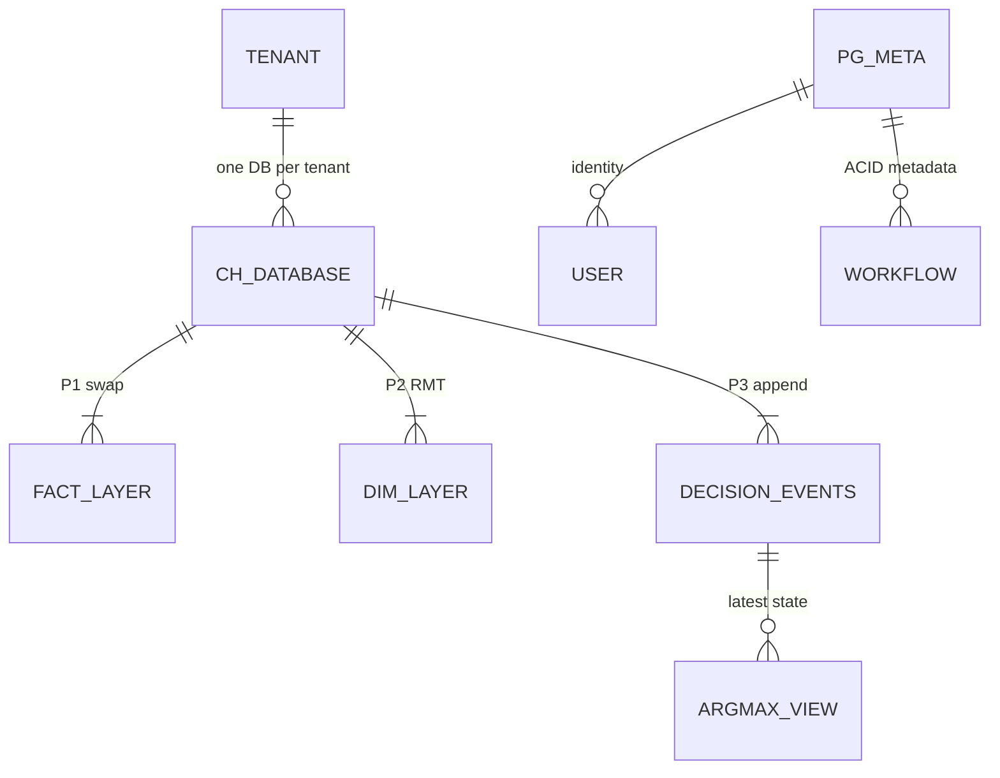
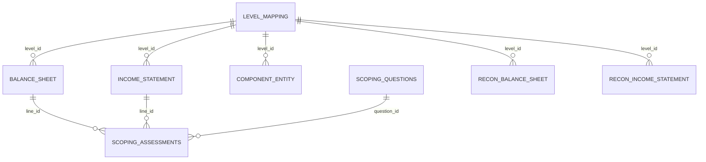
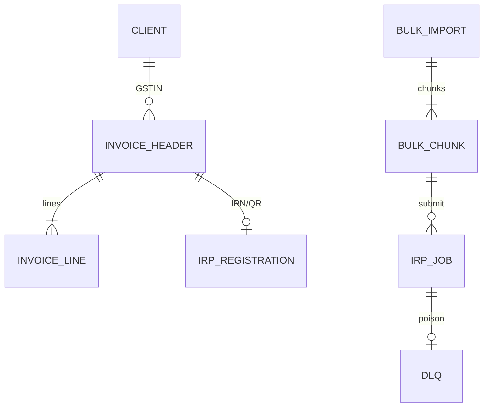
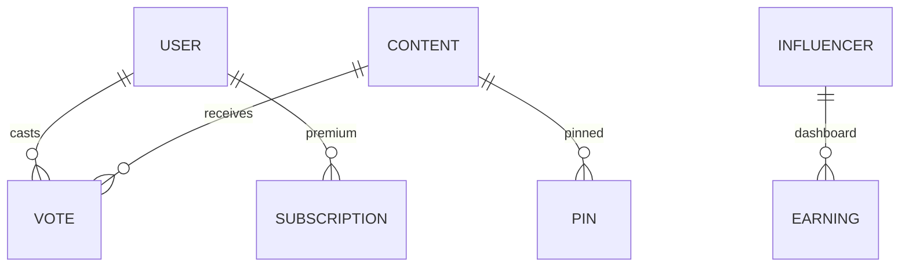

# ER diagrams · table design · why each tech (all resume projects)

One place to whiteboard **database shape** and **tech justification** for every project on the current PDFs.  
Honesty: MEASURED design / MEASURED code / HISTORICAL / DESIGN. Do not invent IA TPS.

**Need columns + API contracts?** → [`35_table_schemas_api_design.md`](35_table_schemas_api_design.md) (IA CH DDL columns, FRM ORM/routes, Menu/Masters/GFG payloads).

**Sources:** FRM ORM (`11_uber_frm_deep_dive`), CH DDL Phase-1 (`29_…`), Masters/GFG packs, Menu packs.  
**Industry alignment (not your metrics):** ClickHouse docs on ReplacingMergeTree / partition swaps; Flink keyed-state dedupe + Kafka ingest (common production pattern).

HTML: [`34_er_tables_tech_why.html`](34_er_tables_tech_why.html)

---

## How to answer in interviews

1. Draw the **ER / store map** first (boxes + join keys).  
2. Name **2–3 critical tables** and their PK / natural key.  
3. For each major tech: **problem → why this tech → rejected alternative**.  
4. Tag numbers MEASURED / TARGET / HISTORICAL.

---

# 1. Impact Analytics — AssortSmart (ClickHouse + thin PG)

**Status:** building (load test pending). Schema = MEASURED design (DDL Phase-1).

### Problem we faced
- Planner probes on shared BigQuery: **1–20s+** variance — too jittery for agent tools.  
- Incumbent product **updates/deletes in place**; ClickHouse **mutations** are async and degrade under many small UPDATEs (industry: CH mutations are not OLTP).  
- Need version history / undo semantics for planning without mutation queues.

### Why each tech

| Tech | Problem | Why chosen | Rejected |
|---|---|---|---|
| **ClickHouse** (per-tenant) | Slow / variance-heavy agent reads; huge pivots | Columnar OLAP; pivot POC **250M 189s→12.3s** (~15.5× MEASURED) | PG-only for heavy grids; CH `ALTER UPDATE` per cell |
| **Insert-only + partition swap** | Mutations pile up | Facts/cubes: stage twin → `REPLACE PARTITION`; decisions append-only; latest via **argMax views** | Row UPDATE / DELETE on hot path |
| **Agent `readonly=1`** | LLM inventing SQL / silent writes | DB profile physically SELECT-only; **14** audited tools | Prompt-only “don’t write” |
| **Go Gin write APIs** | Agent and Manual UI diverging auth | One doing layer for Clustering / Hindsight / Strategy | Agent-owned writes |
| **FastAPI + LangGraph + MCP** | Multi-step explore needs a state machine | Explicit graph + typed tools | Single opaque prompt chain |
| **BigQuery** | Company historical truth | Upstream feed into CH; **not** runtime agent SoR | CH as sole company warehouse |
| **Thin PostgreSQL** | Need real ACID for identity/UAM | Auth, tenant, workflow metadata | Putting all planner facts in PG forever |
| **LangSmith / Datadog / PostHog** | Different debug questions | Agent quality vs platform vs product | One tool for everything |

### Store design (8 layers — draw this)

| Layer | Pattern | Role |
|---|---|---|
| L0 facts + ledger | P1 partition-swap + P4 ledger | Ingested facts, watermarks |
| Grounding dims | P2 RMT + dictionaries | Store / hierarchy / fiscal |
| L1 cubes + caches | P1 / P2 | Planner rollups |
| PG mirrors (transitional) | EXCHANGE / swap | Bridge while migrating |
| Decision plane | P2/P3/P4 | Cluster configs, approvals (append events) |
| Outcome loop | P4 / P1 | Immutable outcomes |
| Write-back (transitional) | P3 status | Wire to incumbent |
| Telemetry | P4 | Probe logs |

**Inventory (MEASURED design):** **63** tables (incl. 7 stage twins) · **8** layers · **5** dictionaries · **19** views · agent R/O · services INSERT-only. Omit **624 columns**.

### ER / relationship sketch (logical)

```
 tenant_db (one CH database per retailer)
   │
   ├─ fact_* / cube_*  ──P1──  stage twin → REPLACE PARTITION
   ├─ dim_* / dict_*   ──P2──  ReplacingMergeTree(version) + FINAL/argMax
   ├─ decision_event_* ──P3──  append-only; v_* views = argMax(event_seq)
   ├─ approval_snapshot──P4──  immutable
   └─ telemetry_*      ──P4──  append-only

 thin Postgres (separate):
   user ──< membership >── tenant
   tenant ──< workflow_state / feature_flags
```

### Mermaid ER (conceptual)



**Industry note (web):** ReplacingMergeTree dedupes on `ORDER BY` during merges; correctness at query time needs `FINAL` or `argMax` — matches our “views over history” doctrine ([ClickHouse RMT guide](https://clickhouse.com/docs/guides/replacing-merge-tree)).

---

# 2. Uber FRM — MySQL scoping service (11 models)

**Status:** shipped platform work. Schema = MEASURED from ORM code.

### Problem we faced
- Quarterly scoping lived in **Google Sheets**: no stable line IDs, no audit trail, overwrite risk, cannot attach comments.  
- SOX-adjacent / **PwC** work papers need durable identity.  
- Join bug: shared column names → silent wrong UUID (column-aliasing).

### Why each tech

| Tech | Problem | Why | Rejected |
|---|---|---|---|
| **MySQL** | Sheets not SoR | Durable UUIDs, period keys, audit columns | Keep Sheets; move straight to warehouse-only |
| **FastAPI + SQLAlchemy 2.0** | Need typed APIs + nested trees | Uber Python service norms; `Mapped` + `.label()` | Flask ad-hoc; raw SQL everywhere |
| **Handler / service / repository** | Parallelize 3 engineers | Clean seams for PR ownership | Fat handlers |
| **React** | Finance interactive grids | 8 screens over REST | Server-rendered only |
| **Bazel + pytest** | Gate PwC-facing merges | Monorepo CI; **1,100+** tests | Ad-hoc scripts |
| **Header auth** (`x-auth-params-email`) | Edge already authenticates | Audit `created_by` / `updated_by` | Re-implement SSO in service |

### Table catalog (11 SQLAlchemy models — scoping service only)

| # | Table | Purpose | Keys / joins |
|---|---|---|---|
| 1 | `balance_sheet` | BS FSLI facts + significance | PK `uuid`; `level_id` → `level_mapping` |
| 2 | `income_statement` | IS FSLI facts | same |
| 3 | `emi_data` | Equity-method investees | PK `uuid` |
| 4 | `frm_metrics_table` | materiality / benchmarks | `metric_key` (e.g. materiality **$340M**) |
| 5 | `scoping_questions` | qualitative questions | deterministic uuid from text+page |
| 6 | `scoping_assessments` | answers per line | `line_id`, `question_id` |
| 7 | `threshold_table_v2` | legal-entity significance | `legal_entity` |
| 8 | `level_mapping` | FSLI hierarchy spine | PK `uuid` = join target `level_id` |
| 9 | `component_entity` | component amounts | `level_id` |
| 10 | `recon_balance_sheet` | HFM vs 10-Q BS | `difference = HFM − filed` |
| 11 | `recon_income_statement` | HFM vs 10-Q IS | same |

**Say:** “**11 models in the scoping service**” — collaboration/comments live elsewhere (16+ in full `schema.uql`).

### ASCII ER

```
                    level_mapping (uuid = level_id)
                         ▲              ▲
         level_id+period │              │ level_id+period
                         │              │
              balance_sheet /     component_entity
              income_statement
                         │
              line_id = fact.uuid
                         ▼
              scoping_assessments ──question_id──► scoping_questions

 frm_metrics_table     threshold_table_v2     emi_data
 recon_balance_sheet / recon_income_statement  (HFM vs 10-Q leaves)
```

### Mermaid ER



Period key on facts: `(fiscal_quarter, fiscal_year)`. Joins AND active flags.

---

# 3. Uber Eats Menu (+ ANZ Mobility separate)

### Problem we faced
- Manual / third-party menu onboarding slow and expensive (~**$2/menu**, **24h**).  
- Scrapers are **bursty and flaky**; anti-bot blocks.  
- Unstructured **PDF/image** menus defeat regex.  
- Need replay when parsers break.

### Why each tech

| Tech | Problem | Why | Rejected |
|---|---|---|---|
| **Selenium** | JS-heavy partner sites | Real browser fetch | Static curl-only |
| **Kafka** | Burst + need replay | Ordered per vendor key; durable log | Sync HTTP into catalog |
| **Flink** | Per-event validate/dedupe/route | Keyed state + event-time; hot path | Spark micro-batch for every page |
| **Milvus + LangChain RAG + Gemini** | Multilingual PDF/image | Retrieve similar labeled menus → generate → schema gate | Pure OCR/regex; inventing Pinecone |
| **IP rotation / proxies / retries** | Anti-bot | Lift success to **95%+** | Fixed IP fleet |
| **GCP / Docker** | Host scrapers/workers | Org footprint | |

**Industry note (web):** Flink keyed state + TTL for dedupe, Kafka as ingest bus, idempotent sink upsert is a standard stream pattern (aligns with our keyed menu-hash dedupe story).

### Logical data design (not a single RDBMS ER)

| Store | Contents | Key |
|---|---|---|
| Kafka topics | raw scrape events, retries, health | vendor / menu key |
| Flink keyed state | seen content hashes | vendor+hash |
| Object storage | raw HTML/PDF/image | content hash |
| **Milvus** | chunk embeddings of labeled menus | vector + menu_id metadata |
| Catalog records | normalized items/prices/modifiers | vendor+item (upsert) |
| Eval fixtures | offline fidelity/schema cases | HISTORICAL **98%/100%** |

### Flow ER-style

```
site ──► scrape_event ──► kafka ──► flink_state(dedupe)
                              │
                    ┌─────────┴─────────┐
                    ▼                   ▼
              catalog_row         rag_chunk ──► milvus
                                      │
                                      ▼
                              extracted_menu ──schema──► catalog_row
```

### ANZ (Mobility — separate product)
Logical entities: `driver`, `vehicle`, `document`, `compliance_check`, `authority_rule`.  
Outcome HISTORICAL: **99.9%**, **~20h/week**. Do **not** mix into Eats Kafka/Flink ER.

---

# 4. Masters India — GST / E-Invoicing

### Problem we faced
- PHP Laravel **sync IRP** blocked workers on filing spikes.  
- Big-bang rewrite risk on compliance product.  
- Double IRP registration is **not recoverable**.  
- Hot quarter writes vs cold history.

### Why each tech

| Tech | Problem | Why | Rejected |
|---|---|---|---|
| **FastAPI microservices** | Monolith deploy/scale | Async IRP; canary cutover | Big-bang rewrite |
| **Kafka** | Ordering + replay + fan-out | Per-GSTIN order; DLQ; multi consumers | Sync-only; Rabbit alone (admit possible for dispatch) |
| **PostgreSQL by tax quarter** | GST is quarter-scoped | Hot writes isolated; archive cold | One fat table forever |
| **MongoDB** | IRN/QR payloads vary | Snapshot signed responses | Force all into rigid PG JSON only |
| **Redis** | Same GSTIN/config on every bulk row | Cache-aside; **−30%** reads HISTORICAL | Hit DB every row |
| **Idempotency + retries + DLQ** | Poison batches / retries | Key `client+fileHash+batchIndex` | Fire-and-forget |
| **ELK + New Relic** | SSH/grep triage | Request-id correlation; **−70%** triage HISTORICAL | |

### Logical ER / tables

```
 client (GSTIN) 1──* invoice_header (period_quarter, invoice_date)
 invoice_header 1──* invoice_line
 invoice_header 1──0..1 irp_registration (irn, qr, status)
 bulk_import 1──* bulk_chunk (file_hash, batch_index) ──idempotency──► irp_job
 irp_job *──► dlq_message (poison)
 mongo: invoice_payload_snapshot (flexible IRP response)
 redis: gstin_master, client_config, irp_token (TTL)
```

Quarter routing: derive quarter from `invoice_date` at API; reject mismatch. Physical: quarter tables/schemas (HISTORICAL narrative).

### Mermaid ER



---

# 5. GeeksforGeeks

### Problem we faced
- PHP backend struggled under **10K+** daily doubts and **10×** contest spikes.  
- Need votes/pins/locks without melting hot rows.  
- Search and flexible content shapes.

### Why each tech

| Tech | Problem | Why | Rejected |
|---|---|---|---|
| **Django** | PHP velocity/reliability | ORM, auth, faster features | Keep PHP forever |
| **MySQL** | Relational truth | Users, votes, subscriptions | Everything in Mongo |
| **MongoDB** | Variable content payloads | Flexible docs | Rigid migrations for every field |
| **Redis** | Contest spikes / hot counters | Cache + async reconcile votes | Sync MySQL increment only |
| **Elasticsearch** | Findability | Full-text beyond `LIKE` | SQL only |
| **Crons** | Video/reminder ops | Batch efficiency **+70%** HISTORICAL | Manual ops |

### Logical ER

```
 user 1──* vote (unique user_id+content_id)
 user 1──* subscription
 content 1──* pin / lock
 content ── indexed ──► elasticsearch_doc
 influencer_account 1──* earning_txn / coupon  (dashboard → +30% course sales HISTORICAL)
 cron_job → video_asset / reminder / cleanup
```

### Mermaid ER



---

## Cheat sheet — one problem per project

| Project | Core data problem | Core tech fix |
|---|---|---|
| IA | Mutation-hostile planner scale + agent safety | CH insert-only 63/8 + R/O agent + Go writes |
| FRM | Sheets not audit-safe | 11-table MySQL SSOT + labeled joins |
| Menu | Burst scrape + unstructured menus | Kafka→Flink + RAG/Milvus/Gemini |
| Masters | Filing-day IRP + no double file | Kafka + quarter PG + idempotency/DLQ |
| GFG | Spikes + engagement features | Django + MySQL/Mongo/Redis/ES |

---

## Study checklist

- [ ] Draw FRM `level_mapping` spine and name all 11 tables  
- [ ] Draw IA 8 layers and say P1 vs P3 in one sentence each  
- [ ] Draw Masters invoice → IRP → Mongo snapshot with idempotency key  
- [ ] Draw Menu Kafka→Flink branches; say ANZ ≠ Eats  
- [ ] For any tech on the PDF: problem → why → rejected  
