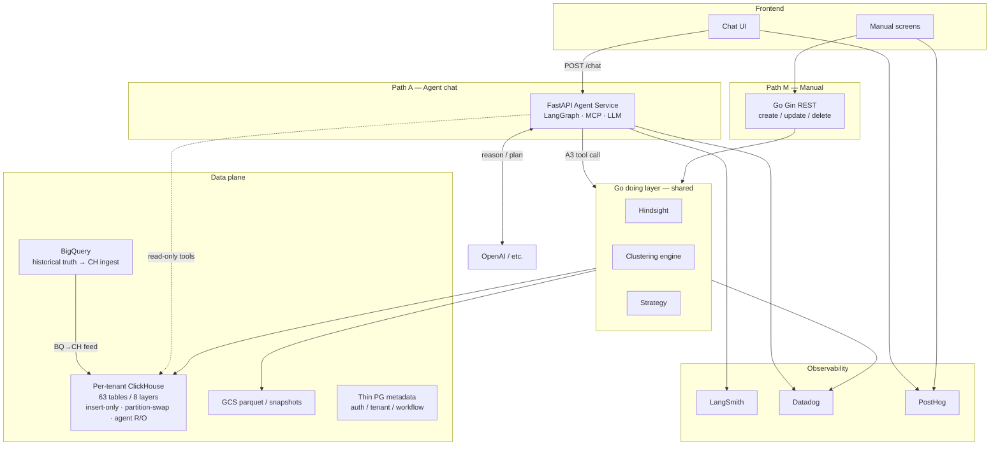

> Canonical interviewer pack for `final_java_pygo_ia` PDF IA bullets (Keep/Drop · QnA · CH POC). Project title: **AssortSmart (Retail Merchandise Planning Platform)**. Synced Aug 2026.

# Impact Analytics — Interview Pack

**Role:** Senior Software Engineer · Impact Analytics, Bangalore · 14 May 2026 – Present (IC)  
**Product:** AssortSmart — AI-powered retail merchandise planning  
**Honesty rule:** Tag every number MEASURED / TARGET / DESIGN / PROJECTED. No IA TPS/RPM (none measured). Keep/Drop + QnA are real assort_kd_flow work; gold/≥80% is a **promotion gate** (not multi-tenant GA). Cluster Copilot / Hindsight = **verbal only / not on PDF**.

---

## 1. 30s / 2min project explain

### 30 seconds (product first)

AssortSmart helps retailers decide **what to buy, how much, and for which stores** a season ahead. On the PDF I lead with four claims: building AssortSmart; architecting the **Keep/Drop engine** (ST%/ROS + LangGraph lenses, agents SELECT-only on ClickHouse via CSV bake-and-promote, promotions gated on **300 gold / ≥80% offline**); a **read-only dig-deeper QnA** over locked Keep/Drop; and ClickHouse adoption proven by a **250M** POC (pivot from **189s to 12.3s**, ~15.5×). Write plane on this track: **Go / Gin**. Cluster Recommendation Copilot / Hindsight are **verbal only / not on PDF**.


### 2 minutes (architecture + evidence)

**PDF path first:** Keep/Drop at article × plan-season → LangGraph lenses → CSV-first bake-and-promote → gold gate → dig-deeper QnA stays read-only over locked decisions. Pipeline: `docs/assort_kd_flow/PIPELINE.md`.

**Evidence that unlocked the analytics store:**
- Pivot POC, row-identical at **250M**: heavy grid from **189.4s to 12.3s** (~**15.5×**, MEASURED).

**Verbal only / not on PDF (if they dig):** Cluster Recommendation Copilot (under 1h / ≥20 TARGET, 8.5% baseline, 14 tools, 3 gates) and Hindsight prior-season layer — building / deep-dive.

**Status:** Keep/Drop + QnA are real `assort_kd_flow` work. Gold / ≥80% is a **promotion gate** — not “shipped to all tenants.”

<details><summary>Broader agentic plane (verbal deep-dive)</summary>


AssortSmart is merchandise planning SaaS:

**Pain (MEASURED on kik — verbal / Copilot context):** **8.5%** clustering-run failures (**37/437**), **>80%** input-boundary mistakes; reproducibility **0%** (winning config/seed never persisted); one manual config in a huge search space; agent probes on shared BigQuery **1–20s+** variance.

**Product inversion (verbal / Copilot context):** planner states hierarchy + reference period → agent grounds scope → batch evaluates many configs (design **20–100**, success bar **≥20**) → UI shows **3–5** distinct scenarios → human gates → write-back. LLM plans and narrates; a **deterministic engine** via **14 audited read-only tools** computes; agent **never writes SQL**.

**Stack (DESIGN / HLD — verbal plane):** Chat FE → FastAPI (LangGraph/MCP). Tool actions hit a **Go, Gin doing layer** (Hindsight / Clustering / Strategy) that Manual UI also uses — one authorization surface. Planning store: per-tenant **ClickHouse, 63 tables / 8 layers**, insert-only / partition-swapped, agent `readonly=1` (service roles INSERT-only). Obs: LangSmith (agent quality) + Datadog (platform) + PostHog (product), stitched by shared OTEL `trace_id`.

**Evidence that unlocked the store:**
- Pivot POC, row-identical at **250M**: heavy grid **189.4s to 12.3s** (~**15.5×**, MEASURED). Verbal honesty: strip `COUNT(DISTINCT)` and typical aggs fall to **~2–3×**; keep option-count and cite **~13–15×**.
- Line-plan: refuse projected **~12B** store-week (4,800 stores × levels × choices × 52 weeks); editable truth at choice×cluster×week **~25M**; month rollup **sub-second**, cell edit **~0.4 ms** on aggregate (MEASURED). Schema win **100–450×**, not “engine magic.”

**Status:** Phase 1 adversarial + external review **PASS, approve to bring-up**. Remaining gate: bring-up load test on real kik extract. I own design and build work in continuous present — not “shipped to all tenants.”

</details>

---

## 2. Architecture diagram



**ASCII (whiteboard fallback):**

```
Planner ──chat──► FastAPI (LangGraph/MCP) ──tools──► Go doing layer ──► ClickHouse/GCS
                         │                              ▲
                         │ LLM reason/plan              │
Manual UI ───────────────┴────── REST ──────────────────┘
BigQuery (truth) ──ingest──► CH (63/8, insert-only / partition-swapped, agent R/O)
Human gates: grounding → search plan → approval → write-back
Obs: LangSmith ↔ Datadog ↔ PostHog via shared OTEL trace_id
```

**Convergence rule:** Path A tools and Path M REST hit the **same** Go APIs. Agent never bypasses Go for mutations. `is_optimal` (engine) ≠ `is_final` (human).

---

## 3. Design decisions

| Decision | Alternatives | Why | Tradeoff |
|---|---|---|---|
| **LangGraph** over ad-hoc FastAPI tool loop | Plain `while` + function-calling; single-shot ReAct | Clustering is stateful: ground → search plan → batch → pins → approval interrupts that must survive reconnect; same graph for wizard Mode A and chat Mode B | Framework surface; harder than a one-shot loop — payoff is checkpointable gates, not prompt spaghetti |
| **MCP** tool delivery on top of LangGraph | Embed OpenAI function schemas in the graph process | LangGraph = *when* to call / pause; MCP = fixed registry of **14** tools with runtime schemas, versioning, read-only enforcement across clients | Extra process boundary + discovery handshake; hard wall between “LLM may select” and “only these tools run” |
| **Go (Gin) doing layer**; FastAPI owns chat only | One Python monolith; Go as BFF in front of chat | Chat is LLM-latency-shaped (streaming, run trees); plan lifecycle / bulk save / clustering / hindsight are throughput I/O — goroutine-per-request, static binary; Manual + agent converge on same APIs | Dual-language tax; Path M must not share a GIL/async pool with multi-second LLM turns |
| **ClickHouse insert-only / partition-swapped** (P1 swap / RMT / events), zero row-level mutations; agent `readonly=1` | PG OLTP mutations; CH `ALTER UPDATE`; lightweight UPDATE (26.5) | Interactive planning + CDC-shaped feeds hate mutation queues; facts/cubes swap partitions; decisions are append-only events; privileges ban UPDATE below sync | Readers need `argMax`/`FINAL`/prune-first shapes; eventual consistency until merge; not a keyed-UPDATE keyboard path without a write-model change |
| **3 human confirm gates** (+ write-back bookend) | Autopilot finalize; prompt-only “ask user”; 6–10 soft confirms | Clustering ships into strategy plans; silent auto-finalize unacceptable; FRD: search plan → approve winner → governance where required | Human-in-the-loop latency; UX must make gates crisp; L2 autopilot / L3 drift are later phases — do not claim |
| **14 audited read-only tools**; agent never writes SQL | Free-form SQL tool; fewer mega-tools; prompt “don’t write” | Numbers must be deterministic and auditable; DB profile is R/O; new capability = new tool, not a prompt tweak | Slower feature velocity; every evidence number must trace to a tool call |
| **~25M aggregate** instead of materializing **~12B** store-week | Flat `line_arch_store_week` SoR; CH-only flat scan; explode-always-in-DB | **~12B** = 4,800 stores × levels × choices × 52 weeks (PROJECTED product); users edit cluster×choice×delivery; `store_week = choice × %s` (partition of unity); explode on demand **~25 ms**; month on 25M: PG **690 ms** / CH **512 ms**; cell **0.35–0.44 ms** | Export slices still need materialization when downstream demands full store-week; override-delta rollups grow with override count |
| **Hybrid POC history → CH E2E for agentic** | Wholesale CH for legacy mtp-assort; stay PG-only forever; dual-write everything | Pivot POC: CH wins heavy grids (**from 189s to 12.3s** at 250M), PG wins sub-ms cells — hybrid *per surface* for assortment. Legacy mtp-assort is OLTP-mutable (JSONB `\|\|`, keyed UPDATE) → **no wholesale CH**. Agentic build changes write model to insert-only versions → **CH/GCS end-to-end** for planning data (Jul 2026 stack + HLD) | Looks politically inconsistent unless you separate surface vs product; dual-store sync tax on hybrid surfaces; must not claim CH beats PG at keyed UPDATE without the write-model unlock |

---

## 4. Bullet-by-bullet defense (PDF Aug 2026)

Pipeline reference: `../docs/assort_kd_flow/PIPELINE.md` · `../../docs/assort_kd_flow/PIPELINE.md`.

### Bullet 1 — Building AssortSmart (product)

| | |
|---|---|
| **Claim** | Building AssortSmart, a retail merchandise planning platform for seasonal buying, store clustering, and assortment decisions. |
| **Tag** | Product framing MEASURED / continuous present |
| **Exact defense** | AssortSmart is live merchandise-planning SaaS. Keep this bullet product-first; Keep/Drop, QnA, and ClickHouse are bullets 2–4. Project title on this PDF: **AssortSmart (Retail Merchandise Planning Platform)**. |
| **Attack vector** | “What do you personally own on AssortSmart?” |
| **Candidate reply** | “Product framing. My PDF ownership is Keep/Drop engine, dig-deeper QnA, and ClickHouse adoption with POC evidence. Cluster Recommendation Copilot and Hindsight are verbal-only / not on PDF if you want the broader roadmap.” |

### Bullet 2 — Keep/Drop engine

| | |
|---|---|
| **Claim** | Architected AssortSmart's Keep/Drop engine at article × plan-season grain, combining deterministic ST%/ROS scoring with LangGraph lenses, kept agents SELECT-only on ClickHouse through CSV-first bake-and-promote, with promotions gated on 300 gold cases and ≥80% offline accuracy. |
| **Tag** | DESIGN + MEASURED offline gate; write plane on this track: **Go / Gin** |
| **Exact defense** | Deterministic ST%/ROS scores first; LangGraph lenses add agentic judgment without letting agents mutate CH. CSV-first bake-and-promote keeps agents SELECT-only. 300 gold / ≥80% offline accuracy is a **promotion gate** — defend as design bar, not multi-tenant GA. Detail: `docs/assort_kd_flow/PIPELINE.md`. |
| **Attack vector** | “Is Keep/Drop shipped to all tenants?” / “Do agents write ClickHouse?” |
| **Candidate reply** | “Agents stay SELECT-only; promotions are gated on the gold set and ≥80% offline accuracy. I will not claim every tenant already runs the promoted path.” |

### Bullet 3 — Dig-deeper QnA over locked Keep/Drop

| | |
|---|---|
| **Claim** | Built a read-only dig-deeper QnA agent over locked Keep/Drop decisions, enabling planners to understand why styles were kept or dropped while schema constraints preserved frozen decisions and blocked writes to ClickHouse, CSVs, and outcomes. |
| **Tag** | DESIGN / building; schema constraints MEASURED in assort_kd_flow |
| **Exact defense** | QnA explains locked outcomes; it must not unfreeze decisions or write CH/CSV/outcomes. Schema constraints are the safety story. |
| **Attack vector** | “Can the QnA agent change a Keep/Drop?” |
| **Candidate reply** | “No — read-only over locked decisions. Writes to ClickHouse, CSVs, and outcomes are blocked by schema constraints.” |

### Bullet 4 — Drove ClickHouse adoption via 250M pivot POC (from 189s to 12.3s, ~15.5×)

| | |
|---|---|
| **Claim** | Drove adoption of ClickHouse as AssortSmart's planning analytics engine, reducing pivot latency from 189s to 12.3s (~15.5×) on 250M rows through a row-identical Postgres-versus-ClickHouse POC. |
| **Tag** | from 189s to 12.3s **MEASURED**; ClickHouse adoption = design direction for planning analytics |
| **Exact defense** | Harness: row-identical 5M/50M/250M; PG native **48 GB** host vs CH **10 CPU / 3.3 GB** Docker — CH still won reads. At 250M PG spills **42 GB**, ~3m grid; CH **12.3s**. Interview depth: **63/8** insert-only DDL, agent `readonly=1` (not on PDF). |
| **Attack vector** | “15.5× is overstated — adversarial said 2–3×.” / “POC said hybrid — why CH for planning?” |
| **Candidate reply** | “Raw heavy grid with option-count is **~15.5×**; strip DISTINCT and typical aggs are **~2–3×**; keep option-count and cite **~13–15×**. POC hybrid for **legacy OLTP-mutable** assortment. Planning analytics / agentic insert-only paths unlocked CH — I did **not** build `pg2ch_cdc`.” |

### Verbal only — Cluster Recommendation Copilot · Hindsight (**not on PDF**)

Use if interviewers ask for broader agentic roadmap. Mark clearly as building / not PDF bullets. Copilot targets (under 1h, ≥20 configs, 8.5%→under 2%, 14 tools, 3 gates) and Hindsight prior-season layer stay deep-dive (`01b_hindsight_defense.md`).

### Verbal only — 8.5% (37/437) → under 2%; 14 tools; 3 gates (**not on PDF**)

| | |
|---|---|
| **Claim** | Cut failures from measured **8.5% (37/437)** toward **under 2%** with **14** audited R/O tools and **3** confirm gates; agent never writes SQL |
| **Tag** | 8.5% MEASURED; under 2% **TARGET**; tools/gates **DESIGN** — off PDF |
| **Candidate reply** | “Correct phrase: **designed to cut from measured 8.5% toward under 2%**. Not on the resume now; Keep/Drop + QnA + CH evidence are. Bring it if they ask about clustering-copilot safety.” |

### Verbal only — 12B → ~25M line-plan (**OMIT from PDF**)

Keep prior line-plan defense for study probes. Not on PDF.


## 5. Mock interview — 12 Q&A

**Interviewer:** You say you are “building” AssortSmart with agents. What ships today vs what is design?

**Candidate:** AssortSmart is live merchandise-planning SaaS. On the PDF I defend Keep/Drop + dig-deeper QnA from `assort_kd_flow` (agents SELECT-only; gold / ≥80% is a promotion gate — not multi-tenant GA) plus the ClickHouse 250M POC. Cluster Recommendation Copilot is Phase 1 design-complete / verbal-only if they ask for that roadmap — not a PDF headline bullet.

---

**Interviewer:** Why LangGraph instead of a plain function-calling loop in FastAPI?

**Candidate:** Clustering is a multi-step stateful workflow with human interrupts: ground scope, confirm search plan, fan out batch compute, stream scores, pause for pins, then approval. LangGraph makes nodes, edges, and checkpointable state explicit so gates survive reconnect and the same graph drives wizard and chat. Plain function calling is fine for one-shot tools; it gets brittle for durable HITL. Tradeoff is framework surface for auditable orchestration.

---

**Interviewer:** Failures 8.5% to under 2% — prove the baseline and stop claiming the target as done.

**Candidate:** kik tenant: **8.5% = 37 of 437** runs; **>80%** are input-boundary mistakes (**MEASURED**). Winning algorithm/hyperparameters/seed were never persisted ⇒ reproducibility **0%**. Target is **under 2%** via deterministic grounding and machine-composed requests, plus content-addressed configs for **100%** reproducibility (**TARGET**). Correct phrase: “designed to cut from a measured 8.5% toward under 2%.” I will not say we hit under 2% until post-load-test metrics exist.

---

**Interviewer:** Walk the 250M pivot number. Hardware was unfair — defend or walk it back.

**Candidate:** Row-identical harness; PG on host with **48 GB**, CH in **10 CPU / 3.3 GB** Docker — CH was **weaker** and still faster on the heavy grid: **189.4s to 12.3s** (~**15.5×**), PG spilled **42 GB**. Adversarial pass: ~90% of that gap is `COUNT(DISTINCT)` / option-count; strip it and typical aggs are **~2–3×**; keep option-count and cite **~13–15×**. On writes, untuned CH cell looked ~82× worse; with durability parity PG still wins **~14×** on single-cell — so hybrid per surface, not a religion. POC-directional, not production cutover.

---

**Interviewer:** Why refuse to materialize the 12B store-week table KiK seems to need?

**Candidate:** **~12B** is the projected explosion of 4,800 stores × levels × choices × 52 weeks. Users never edit that dense grid — they edit cluster×choice×delivery; store-week is 100% re-derived. We store **~25M** choice×cluster×week, explode on demand (**~25 ms**), and keep month rollups **sub-second** with cell edits **~0.4 ms**. Partition-of-unity math reconciles `SUM(flat)==SUM(agg)` to the cent at 10M/100M/1B. Flat near 1B OOM’d the CH VM. Export a slice when needed — never make 12B the SoR.

---

**Interviewer:** Why is chat FE → FastAPI directly? Why isn’t Go the BFF for everything?

**Candidate:** From the HLD: chat is LLM-latency-shaped — LangGraph, MCP, streaming, run trees — Python owns that ecosystem. Go is the **doing layer** for plan lifecycle, bulk saves, clustering/hindsight/strategy, CH/GCS. Manual UI and agent tools converge on the same Go APIs so auth, validation, and audit are not duplicated in the LLM path. Putting Go as a dumb chat proxy adds a hop without buying throughput. Dual language is a real tax; the blast-radius split is the point.

---

**Interviewer:** Three observability products — why not Datadog for everything? How do you debug “agent said X but Go returned Y”?

**Candidate:** LangSmith owns agent quality (run trees, replay, tokens/cost). Datadog owns platform health (HTTP/DB, Go SLOs, infra). PostHog owns product behavior (chat vs manual funnel). Shared OTEL **`trace_id`** stitches one planner utterance across LangSmith and Datadog when the LLM “succeeded” but the tool timed out. Datadog alone does not give prompt replay; LangSmith alone will not page on CH part merges. This is MEASURED design from the HLD — I do not invent MTTR numbers.

---

**Interviewer:** Why dedicated ClickHouse for agent probes instead of shared BigQuery slots you already pay for?

**Candidate:** Interactive copilots need **deterministic** probe latency. Live audit: agent probes on shared BQ **1–20s+** with uncontrolled variance (**MEASURED**). Design target: dedicated CH read plane **p95 <500ms**, nightly precompute aiming **≥80%** cold→warm, cube reconciliation within **0.1%** of BQ (**TARGET**s). BQ stays historical truth; existing BQ→CH ingest isolates agent load from shared slots. Phase 1 non-goal: do not move transactional plan data to CH for classic OLTP edits — read plane first.

---

**Interviewer:** Your POC said hybrid PG writes / CH reads, and “no ClickHouse now” for mtp-assort. Your stack note says CH end-to-end for agentic. Which is it?

**Candidate:** Both, at different scopes. Consolidated POC: hybrid for **legacy assortment surfaces** with keyed UPDATE / JSONB merge; **no wholesale CH** for shipping mtp-assort — fix BQ hygiene first (`SELECT *` jobs billed **38.8 TiB**, etc.). Agentic AssortSmart follows the Jul 2026 directive: planning data on **ClickHouse/GCS end-to-end** because we changed the write model to insert-only versions (`mutations_used=0`). Thin PG for auth/tenant/workflow is fine. I will not pretend CH beats PG at interactive keyed UPDATE without that unlock.

---

**Interviewer:** What breaks at 10× tenants or store universe?

**Candidate:** Nightly precompute and cube partition swaps become the bottleneck — need per-tenant quotas and concurrency budgets (designed; load test pending). Significance matrices and what-if caches grow with store universe — partition strategy and retention must be proven on kik×10 sizing. On the agent side, unbounded tool fan-out melts CH part merges; mitigate with audited tool budgets and bounded Go worker pools on bulk save. If load test misses p95 probe budgets, we revisit precompute before claiming latency targets.

---

**Interviewer:** Can the agent write the cluster master? What is `is_optimal` vs `is_final`?

**Candidate:** No. Engine-enforced **read-only** DB profiles; exploration only on isolated scratch plans; write-back is a separate path after human approval. **`is_optimal`** is the engine’s scored recommendation; **`is_final`** is the human signature. The agent never silently finalizes. Strategy doorway audit found **1 in 5** finalized kik plans with **zero stores** attached — eligibility gates before scoring are not pedantry.

---

**Interviewer:** Ownership challenge — did you build `pg2ch_cdc`, ship the copilot, and own Datadog?

**Candidate:** No on overclaims. **`pg2ch_cdc`** was authored by Ashvin Sharma; where Order Batching CQRS comes up, I designed against its SLOs (commit-to-visible **p95 ≤10s**, snapshot **≥25K rows/s**) — I did not build the CDC platform. Copilot: Phase 1 design approved to bring-up; load test pending; L2/L3 later. Observability stack on the resume is **MEASURED design / instrumentation**, not sole SaaS ownership. Correct language: “designing / building / designed against,” not “I shipped the agent to all tenants.”

---

## 6. Do NOT say

- “We shipped the copilot to production / all tenants” (load test pending; say **building**)
- “We cut failures to under 2%” or “plans finish in under 1 hour today” (those are **TARGET**s; 8.5% is the MEASURED baseline)
- Any **IA TPS / RPM / RPS** (none measured — inventing them is a fail)
- “I built `pg2ch_cdc` end to end” (Ashvin Sharma)
- “Identical benchmark hardware” (PG was stronger in both Order Batching and pivot harnesses)
- “15.5× on every aggregate” without the DISTINCT caveat (verbal: typical **~2–3×**, option-count grids **~13–15×**)
- “12B rows measured in the warehouse” (say **PROJECTED** combinatorial product)
- “ClickHouse replaces Postgres for cell typing” without the insert-only write-model story (PG still wins sub-ms keyed UPDATE)
- “Wholesale ClickHouse for legacy mtp-assort” (POC said **no**; fix BQ first)
- “Hybrid POC contradicts CH E2E” without separating **legacy OLTP surfaces** vs **agentic insert-only planning store**
- “Agent can write SQL / auto-finalize clusters” (`is_optimal` ≠ `is_final`; R/O tools)
- “I own Datadog/LangSmith/PostHog as the platform team” (design split + instrumentation, not sole SaaS ownership)
- Order Batching **60×** / **5.9M rows/s** as if they are the **resume headline** (prep depth only; lead with pivot **from 189s to 12.3s** + line-plan aggregate)
- Flink / Spark / Kubernetes ops / Terraform ownership on IA (out of scope / omit)
- Past-tense “built and shipped the agentic store last quarter” — use **continuous present** for ongoing work
