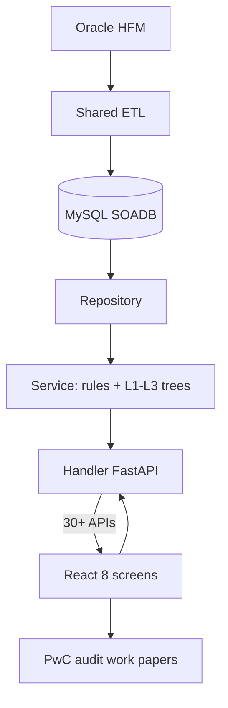
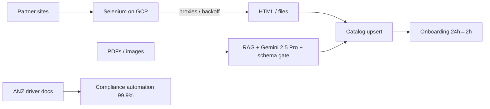

> Canonical packs for FRM + Menu. Menu PDF includes **Kafka + Flink** (not Spark). Synced Jul 2026.

# Uber FRM — Interview Pack

## 1. 30s / 2min explain

**30s:** At Uber Finance I owned the FRM Risk Scoping backend—FastAPI, MySQL—that replaced a quarterly Google Sheets close. **30+ REST APIs** powering **8** screens decide which FSLIs and entities are in scope for PwC, at $340M group materiality on the Q4 2025 close, targeting a 70% cut in manual recon (~2 weeks → ~3–4 days). I owned the Sheets→MySQL recon v2 migration (18 files, parallel /v2 L1→L2→L3 APIs), encoded materiality/residual/5% threshold logic across ~55×14, and led a 3-engineer EPAM pod through API contracts and handler/service/repository design reviews.


**2min:** FRM scoping is a SOX-adjacent quarterly process: which balance-sheet / income-statement lines and which legal entities get risk assessment and audit testing. Before the tool, Finance ran a Sheets workbook—no stable line IDs, no audit trail, concurrent overwrite risk. I owned the **backend** replacement: handler → service → repository over MySQL (SOADB), auth via gateway-injected `x-auth-params-email` (UI consumes the APIs; I did not own frontend). Materiality lives in `frm_metrics_table` ($340M / residual $170M on that close). Rules: Quantitative Material if HFM > materiality; Qualitative from scoping questions; Overall Significance = OR of the two. Component significance uses configurable 5% assets/revenue benchmarks. Eight screens are backed by 30+ REST APIs: Recon, Materiality, EMI, Group Scoping, Threshold Setup, Component Scoping, Residual Risk, Summary. I personally migrated recon from Sheets-backed v1 to MySQL v2 in parallel (18 files, +1,268 LOC) with L1→L2→L3 tree APIs, validating HFM vs public 10-Q per line and durable line IDs for audit. Scale is tens of thousands of GL rows/quarter—correctness and auditability, not big data. 70% is a TDD target, not a measured post-launch KPI.


---

## 2. Architecture

```
Oracle HFM (consolidation)
        │  ETL (shared pipeline — consumes, does not own end-to-end)
        ▼
┌───────────────────────────────────────────────────────────┐
│  MySQL (SOADB) — 11 SQLAlchemy 2.0 models (scoping svc)   │
│  level_mapping ←── balance_sheet / income_statement       │
│                 ←── component_entity                      │
│  recon_* (v2) · frm_metrics_table · threshold_table_v2    │
│  emi_data · scoping_questions / assessments               │
└───────────────────────────────────────────────────────────┘
        ▲
        │  repository (sessions, SQL) → service (rules, trees)
        │  → handler (HTTP, auth, errors)  /frm-scoping/*
┌───────┴───────────────────────────────────────────────────┐
│  FastAPI (langfx) · Pydantic · asyncio.to_thread(DB)      │
│  x-auth-params-email → created_by / updated_by            │
└───────────────────────────────────────────────────────────┘
        ▲
        │  30+ REST APIs
┌───────┴──────────────┐     ┌─────────────────────────────┐
│  React (Fusion.js)   │     │  frm-collaboration-service  │
│  8 screens           │     │  comments / notifications   │
│  → PwC work papers   │     │  (separate — do not claim)  │
└──────────────────────┘     └─────────────────────────────┘
```



---

## 3. Design decisions

| Decision | Choice | Why | Trade-off |
|---|---|---|---|
| Datastore | MySQL SOADB / InnoDB | Platform standard; ACID multi-user edits in close | No Postgres recursive CTEs—hierarchy flattened in ETL |
| Layering | Handler / service / repository | Testability; 3 engineers on same feature without collisions | More files per change |
| Hierarchy | `level_mapping` + `level_id` (no FKs in ORM) | Stable ids; renames don't rewrite facts; join + fiscal period | Logical joins only—app must enforce consistency |
| Materiality rules | Quant OR Qual; 5% component benchmarks | Auditable, deterministic, matches finance process | Qualitative still human-in-loop |
| Recon cutover | Parallel v1 Sheets + v2 MySQL | Zero-downtime; side-by-side QA | Dual path until UI cutover |
| Column identity | SQLAlchemy `aliased()` + `.label()` | Kill silent last-write-wins on joined `uuid` | Strict select discipline on every join |
| Auth | Trust gateway header; record email | Audit trail for SOX-adjacent tool | Fine-grained authz is upstream, not in service |
| Blocking DB | `asyncio.to_thread` | Keep FastAPI event loop responsive | Thread-pool under load (acceptable at this QPS) |

---

## 4. Bullet-by-bullet defense

### Bullet 1 — Owned FRM backend: 30+ APIs powering 8 screens, $340M, targeting 70% (~2 weeks → ~3–4 days)
- **Own:** Backend design + architecture of scoping service (FastAPI/MySQL). ETL shared; collaboration service separate; UI not owned.
- **Say:** 30+ REST APIs powering 8 screens; $340M group materiality (Q4 2025 sample); targeting 70% / ~2 weeks → ~3–4 days (TDD TARGET + ESTIMATED baseline).
- **Do not say:** React/Fusion ownership; measured 70% post-launch; 36 APIs; 19M rows.

### Bullet 2 — Sheets → MySQL recon v2 (18 files); parallel /v2; L1→L2→L3; HFM vs 10-Q; durable line IDs
- **Own:** Recon v2 migration end to end (models, repo, service, handlers, dual-run cutover).
- **Say:** 18 files; `/v2/recon_*` alongside v1; tree aggregation; HFM − 10-Q difference; durable UUIDs for audit/comments.
- **Verbal depth (optional):** column-labeling / join identity lesson — not required on PDF.

### Bullet 3 — Materiality engine: ~55×14; quantitative/qualitative; residual; 5% thresholds; $340M/$170M
- **Own:** Encoding Finance rules in scoping services.
- **Say:** ~55 FSLIs × 14 entities (Q4 2025 sample split ~26 BS + ~29 IS); residual $170M; configurable 5% assets/revenue benchmarks.
- **Do not say:** fixed forever constants — present as that close's sample.

### Bullet 4 — Led 3 engineers; API contracts and handler/service/repository design reviews → PwC
- **Own:** Tech lead of 3-engineer EPAM pod (not people manager).
- **Say:** API contracts and layered design reviews for Finance's quarterly scoping.
- **Do not say:** CI quality gates as the resume punchline.

---

## 5. Mock interview (10 Q&A)

**Q1. Prove "30+ APIs" isn't padding.**  
`setup_routes()` has 32 registrations, one `/health` → 31 functional. "30+" under-claims. 36 would wrongly include collaboration service.

**Q2. Why MySQL not Postgres?**  
SOADB mandate + ACID edits. Working set ~95K raw GL rows/quarter max—correctness problem. Hierarchy flattened into `level_id` in ETL, not recursive SQL at read time.

**Q3. Walk the materiality rule in code terms.**  
Quant YES if HFM > materiality metric. Qual YES from assessment. Overall Significant if either YES. Component FSC if revenue% > benchmark OR |assets%| > benchmark (default 5%, configurable via `PUT /update_benchmark_thresholds`).

**Q4. Explain residual risk.**  
`Residual Balances = HFM − Total in Scope`; `Residual Multiples = Residual / Materiality`. Flags leftover still audit-relevant (e.g. >50% materiality). `GET /residual_risk?fsli_type=bs|is`.

**Q5. Column-aliasing bug—precise failure mode.**  
Raw SQL join projected two columns named `uuid`; `dict(zip(keys, row))` kept mapping uuid; PATCH hit wrong line. Fixed with `.label("fsli_id")` vs `.label("level_mapping_uuid")`.

**Q6. How do you scale this?**  
Barely needs it. Memoized engine `pool_pre_ping`; would add read replicas, per-period GET cache (closed periods immutable), indexes on `(fiscal_quarter, fiscal_year, level_id)`. No Redis in shipped scoping service—don't invent one.

**Q7. Auth is one header—secure enough?**  
Gateway authenticates and injects `x-auth-params-email`; service 401s if missing and records `updated_by`. Authz was upstream. Standalone harden: signed token + roles.

**Q8. Did you build the HFM ETL?**  
No. Service consumes HFM-loaded tables. I owned scoping APIs and recon v2 migration. Shared pipeline responsibility.

**Q9. "Led 3"—evidence.**  
Layered task split (recon = 18 files across 5 layers), enforced conventions from backend syncs, Bazel test gate on every PR. Tech lead of EPAM pod.

**Q10. Is this just a spreadsheet with APIs?**  
Yes on volume, no on risk. Hardness is recursive tree correctness, parent=sum(children), parallel recon migration, identity bugs under close deadline—wrong number becomes PwC evidence.

---

## 6. Do NOT say

- **36 endpoints** (use **30+**).
- **19M → 300K** rows (unsupported; real scale ≤~95K/quarter).
- **70% as measured** (say **targeting**).
- Invented **FRM p95 / Redis / response cache** (engine memoization only).
- **"I built the HFM ETL"** or **"I built collaboration/WebSockets/OCC"**.
- **Coverage %** for FRM (that's Masters); quote test count if pressed.
- Fixed materiality forever—qualify **Q4 2025 close**.

---

# Uber Menu — Interview Pack

## 1. 30s / 2min explain

**30s:** At Uber Eats I owned menu ingestion end to end on GCP — Selenium acquisition, Kafka ingest, Flink keyed normalize/dedupe — cutting onboarding 24h → 2h and saving $600K+/yr at 30K+ menus/month. I hardened the scrape fleet with IP rotation, dynamic proxy pools, and adaptive retries to 95%+ successful ingestions. For multilingual PDF/image menus I owned a LangChain RAG + Gemini 2.5 Pro path over Milvus with a hard schema validation gate before upsert (98% fidelity / 100% schema consistency, offline eval). Separately, under **Uber Mobility**, I automated driver/vehicle document checks for ANZ against local authority requirements to 99.9%, removing ~20 hours/week of manual verification (HISTORICAL — not re-measured here).

**2min:** Partner menus arrive as JS-heavy sites, PDFs, and images. Acquisition is Python Selenium on GCP: rotate IPs, dynamic proxy pools, adaptive retries against anti-bot so fleet success lands in the mid-90s. Structured HTML lands via Kafka ingest + Flink keyed normalize/dedupe into catalog; unstructured payloads go through LangChain RAG → Milvus retrieve similar labeled menus → Gemini 2.5 Pro generate → hard schema validate → low-confidence human review (no SFT on PDF). Eval numbers (98% fidelity, 100% schema consistency) are offline—say that. Economics: killing ~$2/menu third-party tool × 30K × 12 ≈ $720K list → resume floor $600K+. Cycle time 24h → 2h is the ops win. ANZ is a separate Uber Mobility compliance track for driver/vehicle docs vs local authorities (99.9%, ~20h/week HISTORICAL)—not the menu pipeline. Stack on the resume: Python, Selenium, Kafka, Flink, LangChain, Gemini, RAG, Milvus, GCP, Docker.

---

## 2. Architecture

```
Partner sites (JS)          PDFs / images / scans
        │                            │
        ▼                            ▼
┌───────────────────┐      ┌─────────────────────────────┐
│ Selenium scrapers │      │ RAG retrieval (labeled      │
│ GCP · proxy pool  │      │ menus) → Gemini 2.5 Pro     │
│ IP rotate · UA    │      │ → schema validate → gate  │
│ adaptive backoff  │      │ low conf → human review     │
└─────────┬─────────┘      └──────────────┬──────────────┘
          │                               │
          └──────────────┬────────────────┘
                         ▼
                 Catalog upsert
              (idempotent by menu/version)
                         │
                         ▼
              Uber Eats menu onboarding
                 30K+ menus / month
                 24h → 2h cycle

Separate track (not on hot menu path):
  ANZ driver/vehicle docs → Python automation → 99.9% compliance
```



---

## 3. Design decisions

| Decision | Choice | Why | Trade-off |
|---|---|---|---|
| Acquire | Selenium on GCP | JS-rendered partner sites need a real browser | Fragile vs site DOM changes; needs monitoring |
| Anti-bot | IP rotation + dynamic proxies + adaptive backoff | Lift success ~60–65% → 95%+ (baseline EST.) | Cost/latency of proxy fleet |
| Unstructured | RAG + Gemini 2.5 Pro + Milvus + schema gate (no SFT on PDF) | PDFs/images lack stable HTML; schema must be strict | LLM cost; offline eval ≠ live SLA without monitoring |
| Schema gate | Validate before catalog write | 100% schema consistency target | Rejects/queues low-confidence instead of silent bad data |
| Human loop | Low-confidence review | Protect catalog quality | Throughput bound by review capacity |
| Money model | Kill ~$2/menu vendor tool | In-house scrapers at 30K+/mo | Own ops/reliability burden |
| ANZ | Separate Python automation | Different domain (driver docs), same employment | Don't merge into menu architecture story |
| Resume stack | Selenium + Kafka + Flink + RAG/Gemini + ANZ | Matches campaign PDF | Spark stays verbal backfill |

---

## 4. Bullet-by-bullet defense

### Bullet 1 — 24h → 2h; $600K+/yr; 30K+ menus/mo; Selenium on GCP
- **Outcomes:** HISTORICAL ops numbers. Onboarding cycle compressed ~90%.
- **Money:** ~$2/menu × 30K × 12 = $720K list → resume **$600K+** conservative floor.
- **How:** Ship in-house Selenium scrapers on GCP vs paid third-party menu tool.
- **Own:** Acquisition + reliability of scrape fleet landing catalogs faster—not a claim of owning all Eats catalog infra.

### Bullet 2 — 98% fidelity / 100% schema consistency; RAG + Gemini 2.5 Pro + Milvus (no SFT on PDF)
- **Always say offline / eval.** Not a live production SLA unless you instrumented one.
- **Pipeline:** chunk → retrieve similar labeled menus → Gemini generate → hard schema validation gate → human review on low confidence.
- **100% schema:** validation gate rejects malformed structures; fidelity is content correctness vs ground-truth labels.

### Bullet 3 — 95%+ successful menu ingestions; IP rotation, dynamic proxy pools, adaptive retries
- **Endpoint:** mid-90s success after anti-bot hardening.
- **Baseline:** ~60–65% → 95%+ is **ESTIMATED** pre-hardening—say so if pressed.
- **Mechanics:** rotate egress IPs, refresh proxy pools under ban signals, backoff/retry budgets per source so one hostile site doesn't burn the fleet.

### Bullet 4 — ANZ Mobility (separate project): 99.9% compliance; 20 hours/week saved
- **Not Uber Eats.** Own PDF project: **ANZ Driver Document Compliance (Uber Mobility)**.
- Past 4yr wording: Python automation for **driver and vehicle documents** with local authorities for **Uber earners / Uber drivers in the ANZ region**.
- HISTORICAL: 99.9% automated compliance, ~20h/week manual verification removed.
- Do not fold into menu Selenium/RAG architecture.

---

## 5. Mock interview (10 Q&A)

**Q1. Why Selenium and not a simple HTTP client?**  
Partner menus are JS-rendered; static fetch misses items/prices. Browser automation is the acquisition layer; cost is maintenance when DOMs change.

**Q2. Derive the $600K+.**  
Displace ~$2/menu tool × 30K menus/mo × 12 ≈ $720K list; resume cites $600K+ as a conservative floor. HISTORICAL ops claim.

**Q3. 98% / 100%—live or eval?**  
Offline evaluation. Fidelity vs labeled set; schema consistency via validation before write. Don't present as unmeasured production SLI.

**Q4. How does RAG help Gemini here?**  
Retrieve similar already-labeled menus as few-shot context so generation stays on schema and cuisine/layout patterns; then hard schema validate.

**Q5. What does SFT buy over prompt-only?**  
Teaches consistent field layout and enum/schema adherence so fewer invalid JSON/structures hit the gate.

**Q6. Anti-bot: what fails without proxies?**  
IP bans, CAPTCHA walls, soft 403s → success collapses. Rotation + dynamic pools + adaptive backoff recover to 95%+.

**Q7. Idempotent landing—how do you avoid duplicate menus?**  
Upsert keyed by vendor/menu version or content hash so retries after partial scrape don't double-write items.

**Q8. Why is ANZ on the same project block?**  
Same Uber employment, different automation product. Lead with "separate compliance track" so interviewers don't hunt for Kafka in ANZ.

**Q9. Where is Kafka / Flink / Spark on this resume?**  
Not on the Menu PDF. Streaming ownership is framed on Masters India GST e-invoice. Menu story is Selenium + RAG/Gemini + ANZ.

**Q10. Biggest silent failure mode?**  
DOM change or CAPTCHA shift that green-lights empty/partial menus. Defend with scrape-health checks, schema validation, and human review on low confidence—not "we never failed."

---

## 6. Do NOT say

- **Kafka / Flink / Spark** on Menu (PDF and verbal story: Selenium + RAG/Gemini + ANZ only).
- **~200–500 events/sec** or streaming SLOs on Menu.
- **98%/100% as live SLA** without saying **offline eval**.
- **Baseline 60%** as measured fact (call it **estimated**).
- **Pinot**, or merging Menu with IA ClickHouse / Masters Kafka stories.
- Claiming you owned all of Uber Eats catalog platform end-to-end.
