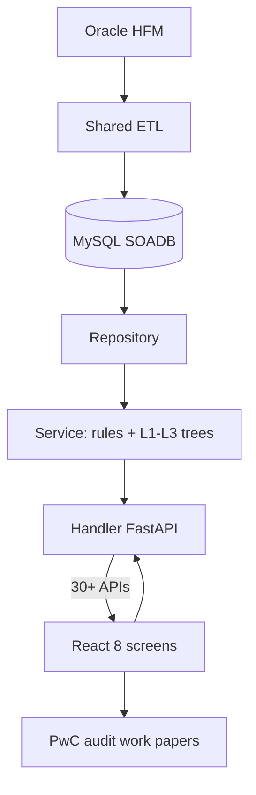
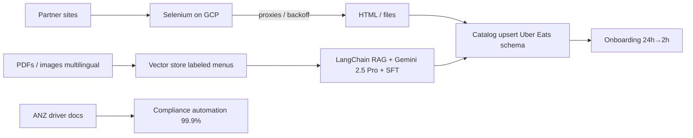

> Canonical interviewer packs for current resume_v2 FRM + Menu bullets. Menu PDF has NO Kafka/Flink/Spark. Synced Jul 2026.

# Uber FRM — Interview Pack

## 1. 30s / 2min explain

**30s:** At Uber Finance I owned the FRM Risk Scoping platform—FastAPI, MySQL, React—that replaced a quarterly Google Sheets close. Eight screens and 30+ REST APIs decide which FSLIs and entities are in scope for PwC, at $340M group materiality on the Q4 2025 close, targeting a 70% cut in manual recon (~2 weeks → ~3–4 days). I designed the 11-table SQLAlchemy 2.0 schema, owned the Sheets→MySQL recon v2 migration (18 files), and led a 3-engineer EPAM pod through reviews and Bazel CI gates.

**2min:** FRM scoping is a SOX-adjacent quarterly process: which balance-sheet / income-statement lines and which legal entities get risk assessment and audit testing. Before the tool, Finance ran a Sheets workbook—no stable line IDs, no audit trail, concurrent overwrite risk. I owned design and architecture for the replacement: handler → service → repository over MySQL (SOADB), Fusion.js React UI, auth via gateway-injected `x-auth-params-email`. Materiality lives in `frm_metrics_table` ($340M / residual $170M on that close). Rules: Quantitative Material if HFM > materiality; Qualitative from scoping questions; Overall Significance = OR of the two. Component significance uses configurable 5% assets/revenue benchmarks. Eight screens: Recon, Materiality, EMI, Group Scoping, Threshold Setup, Component Scoping, Residual Risk, Summary. I personally migrated recon from Sheets-backed v1 to MySQL v2 in parallel (18 files, +1,268 LOC), validating HFM vs public 10-Q per line, and fixed a latent column-aliasing bug where `dict(zip(result.keys(), row))` on joined tables silently took the wrong `uuid`. Scale is tens of thousands of GL rows/quarter—correctness and auditability, not big data. 70% is a TDD target, not a measured post-launch KPI.

---

## 2. Architecture

```
Oracle HFM (consolidation)
        │  ETL (shared pipeline — consumes, does not own end-to-end)
        ▼
┌───────────────────────────────────────────────────────────┐
│  MySQL (SOADB) — 11 SQLAlchemy 2.0 models (scoping svc)   │
│  level_mapping ←── balance_sheet / income_statement       │
│                 ←── component_entity                      │
│  recon_* (v2) · frm_metrics_table · threshold_table_v2    │
│  emi_data · scoping_questions / assessments               │
└───────────────────────────────────────────────────────────┘
        ▲
        │  repository (sessions, SQL) → service (rules, trees)
        │  → handler (HTTP, auth, errors)  /frm-scoping/*
┌───────┴───────────────────────────────────────────────────┐
│  FastAPI (langfx) · Pydantic · asyncio.to_thread(DB)      │
│  x-auth-params-email → created_by / updated_by            │
└───────────────────────────────────────────────────────────┘
        ▲
        │  30+ REST APIs
┌───────┴──────────────┐     ┌─────────────────────────────┐
│  React (Fusion.js)   │     │  frm-collaboration-service  │
│  8 screens           │     │  comments / notifications   │
│  → PwC work papers   │     │  (separate — do not claim)  │
└──────────────────────┘     └─────────────────────────────┘
```



---

## 3. Design decisions

| Decision | Choice | Why | Trade-off |
|---|---|---|---|
| Datastore | MySQL SOADB / InnoDB | Platform standard; ACID multi-user edits in close | No Postgres recursive CTEs—hierarchy flattened in ETL |
| Layering | Handler / service / repository | Testability; 3 engineers on same feature without collisions | More files per change |
| Hierarchy | `level_mapping` + `level_id` (no FKs in ORM) | Stable ids; renames don't rewrite facts; join + fiscal period | Logical joins only—app must enforce consistency |
| Materiality rules | Quant OR Qual; 5% component benchmarks | Auditable, deterministic, matches finance process | Qualitative still human-in-loop |
| Recon cutover | Parallel v1 Sheets + v2 MySQL | Zero-downtime; side-by-side QA | Dual path until UI cutover |
| Column identity | SQLAlchemy `aliased()` + `.label()` | Kill silent last-write-wins on joined `uuid` | Strict select discipline on every join |
| Auth | Trust gateway header; record email | Audit trail for SOX-adjacent tool | Fine-grained authz is upstream, not in service |
| Blocking DB | `asyncio.to_thread` | Keep FastAPI event loop responsive | Thread-pool under load (acceptable at this QPS) |

---

## 4. Bullet-by-bullet defense

### Bullet 1 — Owned design/architecture: 8 screens, 30+ APIs, $340M, targeting 70% (~2 weeks → ~3–4 days)
- **8 screens:** Recon, Materiality, EMI, Group Scoping, Threshold Setup, Component Scoping, Residual Risk, Summary (TDD + Scoping Features).
- **30+ APIs:** Code = 32 `add_api_route` registrations incl. `/health` → 31 functional + health. Say **30+**. Never 36 (that folds collaboration service).
- **$340M:** Q4 2025 sample in `frm_metrics_table`, not a forever constant. Residual $170M same close.
- **70%:** TDD §3.1 **TARGET**. Phrase: "targeting a 70% cut." Baseline ~2 weeks → ~3–4 days is **ESTIMATED** analyst calendar. Never claim measured post-launch.
- **Own:** Design + architecture of scoping service (FastAPI/MySQL/React). ETL shared; collaboration service separate.

### Bullet 2 — 11-table SQLAlchemy 2.0 schema; handler/service/repository; 55 lines / 14 entities
- **11 models:** `balance_sheet`, `income_statement`, `emi_data`, `frm_metrics_table`, `scoping_questions`, `scoping_assessments`, `threshold_table_v2`, `level_mapping`, `component_entity`, `recon_balance_sheet`, `recon_income_statement`. Scope claim to scoping service (physical schema.uql has 16+).
- **Auto-flag:** Quant = HFM > materiality; Qual from assessments; Overall = OR (`conclusion_overall_significance_from_balance_sheet_materials`). Component: revenue% > 5% OR |assets%| > 5%.
- **55 / 14:** ~26 BS + ~29 IS FSLIs and 14 scoped entities on that close. Broader GL ~400 entities / ~1.7–1.8K accounts—don't conflate.

### Bullet 3 — Sheets → MySQL v2 recon (18 files); HFM vs 10-Q; column-aliasing bug
- **Ownership:** Branch `tmitta1/recon-income-api-migration`, 18 files, +1,268 / −4, `RECON_API_MIGRATION.md`.
- **Pattern:** Add `/v2/recon_*` beside v1; nested L1→L2→L3 tree; `difference = hfm_amount_in_millions − financial_statement_amount_in_millions`.
- **Bug:** Joined fact + `level_mapping` → duplicate result keys → `dict(zip(...))` last-write-wins → wrong `uuid` for PATCH/comments. Fix: labeled `select()` on `aliased()` models.
- **Guardrail:** Tool surfaces/persists breaks; human sign-off is procedural—don't claim hard-block.

### Bullet 4 — Led 3 engineers; design reviews, API contracts, CI gates → PwC
- **Led:** Tech lead of 3-engineer EPAM pod (not people manager). Slice by layer; enforce thin handlers, service trees, repo sessions; PR tests + Bazel `uber_py_test` (resume-safe: 1,100+ tests; grep ~1,288).
- **PwC:** Scoping output feeds external audit work papers (TDD). Don't claim you built collaboration/WebSocket OCC.

---

## 5. Mock interview (10 Q&A)

**Q1. Prove "30+ APIs" isn't padding.**  
`setup_routes()` has 32 registrations, one `/health` → 31 functional. "30+" under-claims. 36 would wrongly include collaboration service.

**Q2. Why MySQL not Postgres?**  
SOADB mandate + ACID edits. Working set ~95K raw GL rows/quarter max—correctness problem. Hierarchy flattened into `level_id` in ETL, not recursive SQL at read time.

**Q3. Walk the materiality rule in code terms.**  
Quant YES if HFM > materiality metric. Qual YES from assessment. Overall Significant if either YES. Component FSC if revenue% > benchmark OR |assets%| > benchmark (default 5%, configurable via `PUT /update_benchmark_thresholds`).

**Q4. Explain residual risk.**  
`Residual Balances = HFM − Total in Scope`; `Residual Multiples = Residual / Materiality`. Flags leftover still audit-relevant (e.g. >50% materiality). `GET /residual_risk?fsli_type=bs|is`.

**Q5. Column-aliasing bug—precise failure mode.**  
Raw SQL join projected two columns named `uuid`; `dict(zip(keys, row))` kept mapping uuid; PATCH hit wrong line. Fixed with `.label("fsli_id")` vs `.label("level_mapping_uuid")`.

**Q6. How do you scale this?**  
Barely needs it. Memoized engine `pool_pre_ping`; would add read replicas, per-period GET cache (closed periods immutable), indexes on `(fiscal_quarter, fiscal_year, level_id)`. No Redis in shipped scoping service—don't invent one.

**Q7. Auth is one header—secure enough?**  
Gateway authenticates and injects `x-auth-params-email`; service 401s if missing and records `updated_by`. Authz was upstream. Standalone harden: signed token + roles.

**Q8. Did you build the HFM ETL?**  
No. Service consumes HFM-loaded tables. I owned scoping APIs and recon v2 migration. Shared pipeline responsibility.

**Q9. "Led 3"—evidence.**  
Layered task split (recon = 18 files across 5 layers), enforced conventions from backend syncs, Bazel test gate on every PR. Tech lead of EPAM pod.

**Q10. Is this just a spreadsheet with APIs?**  
Yes on volume, no on risk. Hardness is recursive tree correctness, parent=sum(children), parallel recon migration, identity bugs under close deadline—wrong number becomes PwC evidence.

---

## 6. Do NOT say

- **36 endpoints** (use **30+**).
- **19M → 300K** rows (unsupported; real scale ≤~95K/quarter).
- **70% as measured** (say **targeting**).
- Invented **FRM p95 / Redis / response cache** (engine memoization only).
- **"I built the HFM ETL"** or **"I built collaboration/WebSockets/OCC"**.
- **Coverage %** for FRM (that's Masters); quote test count if pressed.
- Fixed materiality forever—qualify **Q4 2025 close**.

---

# Uber Menu — Interview Pack

## 1. 30s / 2min explain

**30s:** At Uber Eats I cut menu onboarding from 24h to 2h and saved $600K+/yr on 30K+ menus/month by shipping Selenium scrapers on GCP with Kafka ingest and Flink keyed normalize/dedupe, plus proxy/backoff defenses that raised successful ingestions to 95%+. Unstructured multilingual menus arrive as PDFs and images — I built a LangChain RAG + Gemini 2.5 Pro pipeline over a vector store of labeled menus, with SFT for schema adherence, hitting 98% fidelity and 100% schema consistency on offline eval into Uber Eats catalog shape. Separately, under **Uber Mobility**, I automated driver/vehicle document compliance for **Uber drivers in ANZ** to 99.9% and saved ~20 hours/week (HISTORICAL from prior resume — not re-measured here).

**2min:** Partner menus arrive as JS-heavy sites, PDFs, and images in multiple languages. Acquisition is Python Selenium on GCP: rotate IPs, dynamic proxy pools, adaptive backoff against anti-bot so fleet success lands in the mid-90s. Structured HTML paths land in catalog; unstructured payloads go through: chunk/OCR-ish parse → embed/retrieve similar labeled menus from a **vector store** (LangChain RAG) → **Gemini 2.5 Pro** generate Uber Eats schema fields → schema validate → low-confidence human review, with supervised fine-tuning for schema adherence. This matches the industry pattern used by delivery platforms (OCR/LLM structure + retrieval grounding + human gate) — defend *your* LangChain/RAG/Gemini/vector-store ownership, not Uber INCA internals. Eval numbers (98% fidelity, 100% schema consistency) are **offline**—say that. Economics: killing ~$2/menu third-party tool × 30K × 12 ≈ $720K list → resume floor $600K+. Cycle time 24h → 2h is the ops win. ANZ is a separate Mobility compliance track for driver/vehicle docs (99.9%, 20h/week HISTORICAL)—not the menu pipeline. Stack: Python, Selenium, Kafka, Flink, LangChain, Gemini, RAG, vector DB, SFT, GCP, Docker.

---

## 2. Architecture

```
Partner sites (JS)          PDFs / images (multilingual)
        │                            │
        ▼                            ▼
┌───────────────────┐      ┌─────────────────────────────┐
│ Selenium scrapers │      │ LangChain RAG               │
│ GCP · proxy pool  │      │ vector store (labeled menus)│
│ IP rotate · UA    │      │ → Gemini 2.5 Pro → SFT      │
│ adaptive backoff  │      │ schema validate → human     │
└─────────┬─────────┘      └──────────────┬──────────────┘
          │                               │
          └──────────────┬────────────────┘
                         ▼
                 Catalog upsert (Uber Eats schema)
              (idempotent by menu/version)
                         │
                         ▼
              Uber Eats menu onboarding
                 30K+ menus / month
                 24h → 2h cycle

Separate track (not on hot menu path):
  ANZ driver/vehicle docs → Python automation → 99.9% compliance
```



---

## 3. Design decisions

| Decision | Choice | Why | Trade-off |
|---|---|---|---|
| Acquire | Selenium on GCP | JS-rendered partner sites need a real browser | Fragile vs site DOM changes; needs monitoring |
| Anti-bot | IP rotation + dynamic proxies + adaptive backoff | Lift success ~60–65% → 95%+ (baseline EST.) | Cost/latency of proxy fleet |
| Unstructured | LangChain RAG + Gemini + vector store + SFT | PDFs/images/multilingual lack stable HTML; need grounding + strict schema | LLM cost; offline eval ≠ live SLA without monitoring |
| Vector store | Embeddings of labeled menus | Retrieve similar cuisine/layout examples for RAG grounding (industry pattern) | Index freshness; don’t invent vendor name |
| Schema gate | Validate before catalog write | 100% schema consistency target | Rejects/queues low-confidence instead of silent bad data |
| Human loop | Low-confidence review | Protect catalog quality (DoorDash-style guardrail idea) | Throughput bound by review capacity |
| Money model | Kill ~$2/menu vendor tool | In-house scrapers at 30K+/mo | Own ops/reliability burden |
| ANZ | Separate Mobility automation | Driver/vehicle docs, Uber drivers in ANZ | Don't merge into menu architecture story |
| Resume stack | Selenium + Kafka/Flink + LangChain RAG/Gemini/vector DB | Matches PDF | Spark/Pinot verbal only if asked |

---

## 4. Bullet-by-bullet defense

### Bullet 1 — 24h → 2h; $600K+/yr; 30K+ menus/mo; Selenium + Kafka/Flink
- **Outcomes:** HISTORICAL ops numbers. Onboarding cycle compressed ~90%.
- **Money:** ~$2/menu × 30K × 12 = $720K list → resume **$600K+** conservative floor.
- **How:** Ship in-house Selenium scrapers on GCP + Kafka ingest + Flink keyed normalize/dedupe/replay vs paid third-party menu tool.
- **Own:** Acquisition + reliability of scrape fleet landing catalogs faster—not a claim of owning all Eats catalog infra.

### Bullet 2 — Multilingual PDFs/images → Uber Eats schema; LangChain RAG + Gemini + vector store + SFT; 98%/100% offline
- **Always say offline / eval.** Not a live production SLA unless you instrumented one.
- **Why LLM:** unstructured menus (PDFs, images, different languages) defeat regex/HTML parsers; need schema-shaped Uber Eats catalog rows.
- **Pipeline:** parse/chunk → retrieve similar labeled menus from **vector store** (LangChain RAG) → Gemini generate → schema validate → SFT for schema adherence → human review on low confidence.
- **100% schema:** validation gate rejects malformed structures; fidelity is content correctness vs ground-truth labels.
- **Industry parallel:** DoorDash menu transcription uses OCR→LLM structure + confidence/human gate; RAG retrieves similar items for grounding. Cite pattern, not their proprietary stack.
- **Do not invent:** Pinecone/Weaviate product name, OCR vendor, or live MTTR numbers.

### Bullet 3 — 95%+ successful ingestions; IP rotation, dynamic proxies, adaptive backoff
- **Endpoint:** mid-90s success after anti-bot hardening.
- **Baseline:** ~60–65% → 95%+ is **ESTIMATED** pre-hardening—say so if pressed.
- **Mechanics:** rotate egress IPs, refresh proxy pools under ban signals, backoff/retry budgets per source so one hostile site doesn't burn the fleet.

### Bullet 4 — ANZ Mobility (separate project): 99.9% compliance; 20 hours/week saved
- **Not Uber Eats.** Own PDF project: **ANZ Driver Document Compliance (Uber Mobility)**.
- Past 4yr wording: Python automation for **driver and vehicle documents** with local authorities for **Uber earners / drivers in the ANZ region**.
- **99.9%** and **20h/week:** HISTORICAL from that resume line — **not** re-measured from logs in this repo. Say HISTORICAL if pressed.
- Do not say “main-app.” Do not fold into menu Selenium/RAG architecture.

---

## 5. Mock interview (10 Q&A)

**Q1. Why Selenium and not a simple HTTP client?**  
Partner menus are JS-rendered; static fetch misses items/prices. Browser automation is the acquisition layer; cost is maintenance when DOMs change.

**Q2. Derive the $600K+.**  
Displace ~$2/menu tool × 30K menus/mo × 12 ≈ $720K list; resume cites $600K+ as a conservative floor. HISTORICAL ops claim.

**Q3. 98% / 100%—live or eval?**  
Offline evaluation. Fidelity vs labeled set; schema consistency via validation before write. Don't present as unmeasured production SLI.

**Q4. How does RAG help Gemini here?**  
Retrieve similar already-labeled menus from a **vector store** as few-shot/context so generation stays on Uber Eats schema and cuisine/layout patterns across languages; then hard schema validate. LangChain wires retrieve→prompt→LLM.

**Q5. What does SFT buy over prompt-only?**  
Teaches consistent field layout and enum/schema adherence so fewer invalid JSON/structures hit the gate.

**Q6. Anti-bot: what fails without proxies?**  
IP bans, CAPTCHA walls, soft 403s → success collapses. Rotation + dynamic pools + adaptive backoff recover to 95%+.

**Q7. Idempotent landing—how do you avoid duplicate menus?**  
Upsert keyed by vendor/menu version or content hash so retries after partial scrape don't double-write items.

**Q8. Is ANZ part of Uber Eats?**  
No. Same Uber/EPAM employment, **Uber Mobility** — **Uber drivers in ANZ**. Driver + vehicle docs vs local authorities. Separate project on the PDF. 20h/week is HISTORICAL from prior resume.

**Q9. Where is Kafka / Flink on Menu?**  
On the Menu PDF: Kafka ingest + Flink keyed normalize/dedupe/replay for bursty scrapes. Masters also has Kafka for GST IRP bulk — different product.

**Q10. Biggest silent failure mode?**  
DOM change or CAPTCHA shift that green-lights empty/partial menus; or LLM inventing items without retrieval grounding. Defend with scrape-health checks, schema validation, RAG grounding, and human review on low confidence.

---

## 6. Do NOT say

- ANZ as an **Uber Eats / menu catalog** feature (it is **Mobility drivers** in ANZ).
- “**main-app**” wording on ANZ.
- Invented ANZ stack (Selenium menu stack ≠ doc compliance automation).
- Named vector vendor (Pinecone/etc.) you cannot defend — say **vector store**.
- **~200–500 events/sec** or streaming SLOs as measured Menu facts.
- **98%/100% as live SLA** without saying **offline eval**.
- **Baseline 60%** as measured fact (call it **estimated**).
- **Pinot** / Spark as Menu PDF claims unless asked.
- Claiming you owned all of Uber Eats catalog platform / INCA end-to-end.
- Claiming **20h/week** was re-measured from logs in this repo (HISTORICAL past-resume only).
