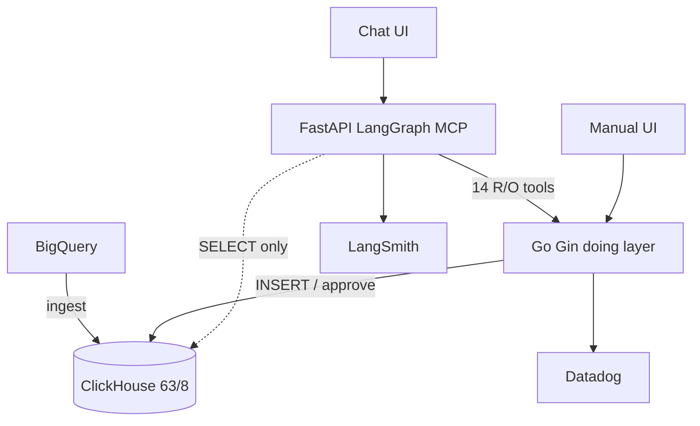
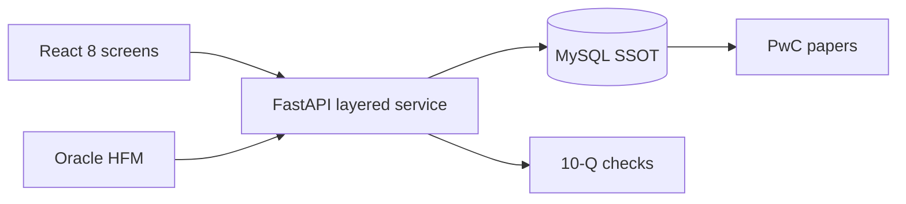
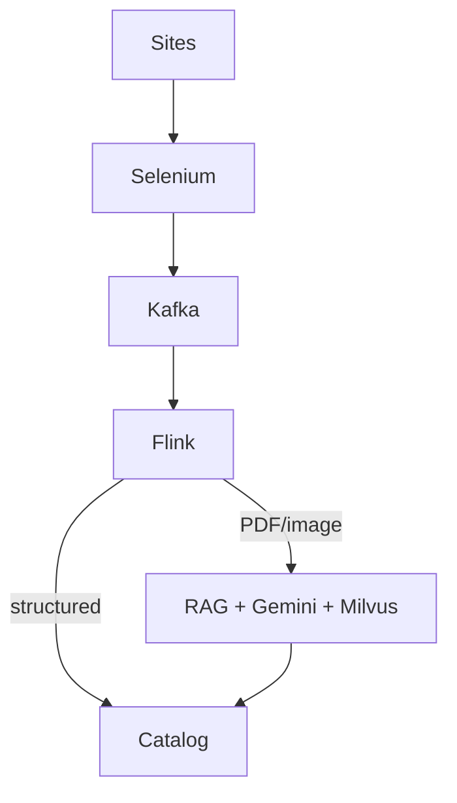
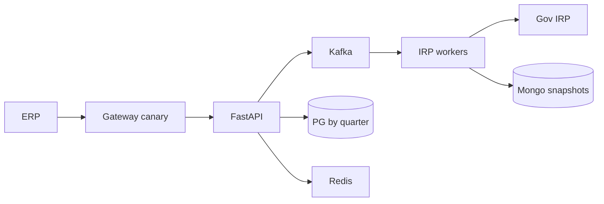
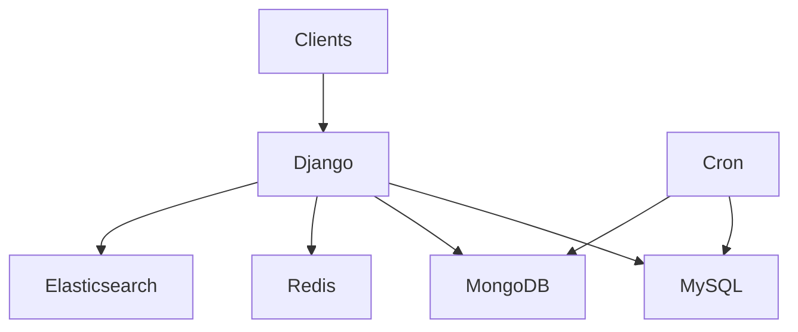

# Architecture · flow · ER diagrams (v2 / Java / PyGo tracks)

Whiteboard-ready diagrams for every project on the current PDFs. Style inspired by the original prep’s ASCII box-arrow clarity, plus mermaid for Pages rendering. Facts match `GROUND_TRUTH.md` — not copied from original resume narratives.

**How to use:** Sketch the ASCII in interviews; open the HTML hub for live mermaid. Java track: swap FastAPI→Spring Boot / Gin→Spring verbally.

---

## 1. Impact Analytics — AssortSmart (building)

### Architecture (ASCII)

```
 Planner (Chat UI)          Planner (Manual / Hindsight UI)
        │                              │
        ▼                              ▼
 ┌──────────────────────┐     ┌─────────────────────────┐
 │ FastAPI + LangGraph  │     │ Go Gin write APIs       │
 │ + MCP (agent plane)  │     │ (shared doing layer)    │
 │ 14 read-only tools   │────►│ Clustering / Hindsight  │
 │ 3 human confirm steps│     │ / Strategy              │
 └──────────┬───────────┘     └───────────┬─────────────┘
            │ read-only                    │ INSERT / approve path
            ▼                              ▼
 ┌──────────────────────────────────────────────────────┐
 │ Per-tenant ClickHouse  (63 tables / 8 layers)        │
 │ insert-only · refresh by swapping partitions         │
 │ agent profile: SELECT only                           │
 └──────────▲───────────────────────────────┬───────────┘
            │ BQ → CH ingest                │
     ┌──────┴──────┐                 ┌──────▼──────┐
     │  BigQuery   │                 │ GCS / snaps │
     │ (historical)│                 └─────────────┘
     └─────────────┘
 Obs: LangSmith (agent) · Datadog (platform) · PostHog (product)
      ── shared OTEL trace_id ──
```

### User flow (clustering copilot)

```
Intent → Ground scope (tools) → Confirm search plan → Batch explore configs
      → Present 3–5 scenarios → Human approve → Write via Go APIs → Grid refresh
```

### Mermaid



### Why each box
| Box | Problem it solves |
|---|---|
| LangGraph/MCP | Sequence audited tools; no free-form SQL from the LLM |
| Go doing layer | Same write path as Manual UI — one auth surface |
| CH insert-only | Avoid mutation queue; pivots stay fast (189s→12.3s POC) |
| Human gates | Agent never silently finalizes plans |

---

## 2. Uber FRM — Risk Scoping

### Architecture (ASCII)

```
 React (8 screens)
   Recon · Materiality · EMI · Group · Component · Residual · Summary · …
        │  30+ REST
        ▼
 ┌─────────────────────────────────────────┐
 │ FastAPI  (or Spring Boot on Java track) │
 │  handler / controller                   │
 │       ▼                                 │
 │  service  (materiality rules, trees)    │
 │       ▼                                 │
 │  repository  (SQLAlchemy 2.0 / JPA)     │
 └──────────────────┬──────────────────────┘
                    ▼
            ┌───────────────┐
            │ MySQL SSOT    │  ~11 models
            │ facts · EMI   │  55 FSLIs / 14 entities
            │ recon leaves  │  $340M / $170M sample
            └───────▲───────┘
                    │
     Oracle HFM ────┘──── public 10-Q (validate)
                    │
                    ▼
              PwC work papers
```

### Quarterly user flow

```
Load HFM → Recon vs 10-Q → Set materiality → Group/Component scope
  → Residual / EMI flags → Summary → Export to audit
```

### Logical ER (say this, don’t invent extra tables)

```
fiscal_period 1──* fslib_fact (BS/IS lines)
entity 1──* component_assessment
fslib_fact *──* scoping_decision (material / qualitative)
emi_investee 1──* emi_assessment
recon_leaf (HFM amt, filed amt, difference, line_id)
metrics_table (materiality, residual threshold)
```

### Mermaid



---

## 3. Uber Eats Menu + ANZ Mobility (separate)

### Architecture (ASCII)

```
 Third-party menu sites (HTML / PDF / image)
        │  Selenium + IP rotate / proxies / retries
        ▼
 ┌─────────────────┐
 │ Kafka ingest bus│  ordered per vendor key · replayable
 └────────┬────────┘
          ▼
 ┌─────────────────┐
 │ Flink normalize │  validate · keyed dedupe · route
 └────┬────────┬───┘
      │        │ unstructured
      │        ▼
      │   ┌──────────────────────────────┐
      │   │ LangChain RAG + Gemini 2.5   │
      │   │ Pro over Milvus              │
      │   │ schema gate → human if low   │
      │   └──────────────┬───────────────┘
      │ structured       │
      ▼                  ▼
 ┌────────────────────────────┐
 │ Uber Eats catalog upsert   │
 └────────────────────────────┘

 ANZ (Mobility — NOT Eats):
 Driver/vehicle docs → compliance checks → 99.9% · ~20h/week HISTORICAL
```

### User / ops flow

```
Scrape → Kafka → Flink → (catalog | RAG/Milvus/Gemini) → validate → live menu
Success target 95%+ · onboarding 24h→2h · $600K+/yr · 30K+ menus/mo
```

### Mermaid



---

## 4. Masters India — GST / E-Invoicing

### Architecture (ASCII)

```
 Client ERP / Dashboard
        │
 ┌──────▼──────────────────────────────┐
 │ API Gateway  (canary % → FastAPI)   │
 │              (fallback → PHP)       │
 └──────┬──────────────────────────────┘
        ▼
 FastAPI microservices (auth · submit · bulk · recon)
        │
   ┌────┼────────────┬──────────────┐
   ▼    ▼            ▼              ▼
  PG   Redis      Kafka topics    MongoDB
  (by  (hot       (chunks · IRP   (IRN/QR
  tax  config)     jobs · hooks)   snapshots)
  qtr)
        │
        ▼
  Workers ──idempotency + retries + DLQ──► Government IRP
        │
   ELK + New Relic (request-id correlation)
```

### Bulk IRP flow

```
File → validate chunks → Kafka → IRP workers → signed response → webhook/dashboard
Key: client + fileHash + batchIndex  (no double register with gov)
```

### Mermaid



---

## 5. GeeksforGeeks

### Architecture (ASCII)

```
 Learners / influencers
        │
        ▼
 ┌──────────────────┐
 │ Django REST APIs │  (PHP → Django migration)
 └────────┬─────────┘
     ┌────┼────┬────────┐
     ▼    ▼    ▼        ▼
   MySQL Mongo Redis  Elasticsearch
     │
     ▼
 Cron workers — video · reminders · cleanup   (+70% ops, separate from sales)
 Influencer dashboard — earnings / coupons     (+30% course sales)
 Votes / pins / locks                           (+15–20% premium)
```

### Mermaid



---

## Whiteboard checklist

- [ ] Draw AssortSmart agent vs doing layer split and where SQL is forbidden  
- [ ] Draw FRM handler→service→repo→MySQL and HFM/10-Q inputs  
- [ ] Draw Menu Selenium→Kafka→Flink with RAG branch; say ANZ ≠ Eats  
- [ ] Draw Masters gateway canary + Kafka IRP + quarter PG  
- [ ] Name one rejected alternative per critical box  
